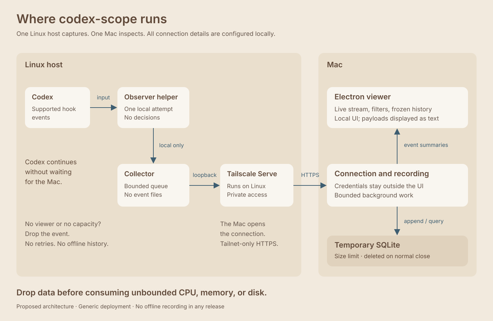
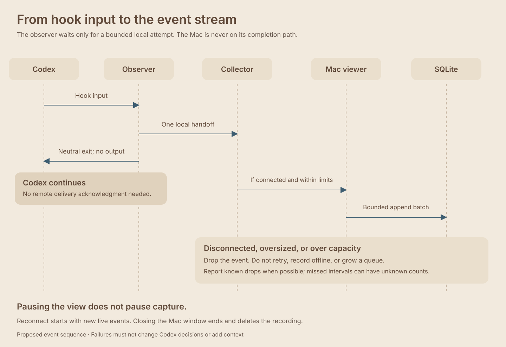
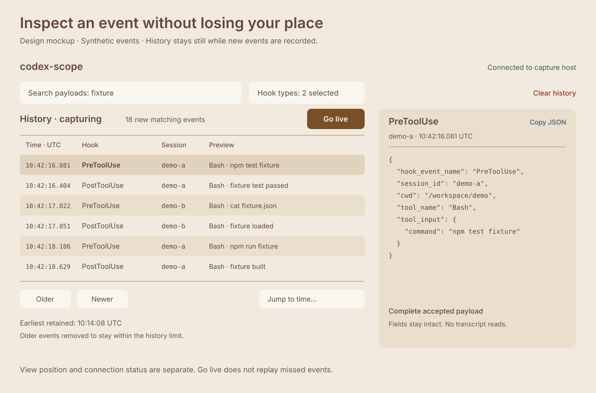

# codex-scope

A live inspector for Codex hook events. Capture on a Linux host, inspect on a Mac, and keep a bounded, temporary history while the viewer is open.

**Status: Linux capture implemented for synthetic testing; real-session and Mac validation remain.** The images describe the intended application. The Linux observer, collector, installer, and diagnostic viewer run independently of Electron. Start with [Linux development](linux/README.md) and [remaining work](plan.md).

Codex must keep working when capture fails. Missing events are acceptable; blocking a session, changing a hook decision, or exhausting the laptop's resources is not.

## Where it runs

One Linux capture host serves one macOS viewer. Multiple Codex sessions can appear in the same stream. Tailscale Serve is the documented remote connection method; the viewer accepts a configured endpoint rather than depending on a particular machine or tailnet.

## How capture behaves

Observers receive the payloads Codex supplies to supported hook events. They do not wrap existing hook commands, inspect their output, read transcripts, or collect environment variables. Accepted payloads retain their original fields. Oversized or excess events are dropped instead of silently truncated.

An explicit install command registers account-level observers while preserving existing hooks. Uninstall removes only unchanged entries owned by codex-scope. These commands are tested against isolated configuration; actual account installation and real-session behavior remain unverified. Codex's own hook trust process still applies.

No offline recording is planned, in this or later releases. Events generated while disconnected can be lost permanently. The viewer will distinguish known drops from intervals where the loss count is unknown.

## Explore the stream

- Follow incoming events, or freeze the view while capture continues.
- Filter by hook type and free text across retained payloads.
- Scroll through older and newer events, jump to a time, or return to live.
- Inspect and copy an event's complete accepted payload.
- Clear history without closing the app.

There is no historical playback. The viewport, loaded rows, pending work, payload sizes, and SQLite storage all have limits. Older history is evicted as necessary; the interface shows what remains available.

## Run from a clone

Run `make -C linux test` to build and test the Linux implementation without Electron. [Linux development](linux/README.md) includes synthetic capture commands and tested tool versions. The Mac application will have its own development command. Signing, notarization, automatic updates, and a Mac installer are outside the initial build.

`linux/` owns Linux code, dependencies, commands, and tests. `electron/` is reserved for the Mac application and its independent tooling. `protocol/` contains the shared wire contract and synthetic fixtures; neither application imports the other's implementation. Root `AGENTS.md` records project principles.

See [deployment](docs/deployment.md) for the proposed setup using fictional connection details, and [architecture](docs/architecture.md) for responsibilities and failure behavior. [ux.md](ux.md) records the viewing experience.

## Data lifetime and privacy

SQLite history lives on the Mac. Normal window close quits the app and deletes its recording directory, including database sidecar files. After a crash, the next launch removes abandoned recording files. Closing the window is distinct from hiding or minimizing it. Deletion is ordinary filesystem cleanup, not forensic secure erasure.

The Linux collector has no event files or database. It discards undelivered events when the connection ends. A dead connection may take a bounded heartbeat timeout to detect.

Raw hook payloads can contain commands, paths, prompt text, or secrets already supplied to Codex. They stay inside the configured connection and local recording. There is no telemetry or payload logging. Examples and screenshots in this repository use synthetic data. Keep real endpoints, credentials, captures, and machine configuration outside Git.

## References

- [Codex hooks](https://learn.chatgpt.com/docs/hooks)
- [Tailscale Serve](https://tailscale.com/docs/reference/tailscale-cli/serve)
- [Electron security guidance](https://www.electronjs.org/docs/latest/tutorial/security)
- [MIT license](LICENSE)
