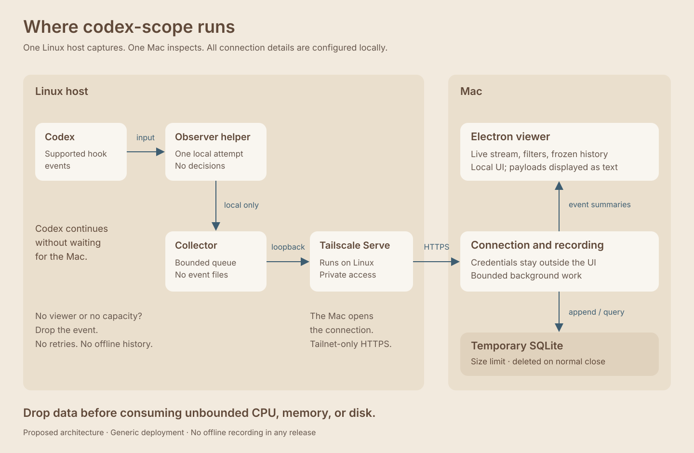
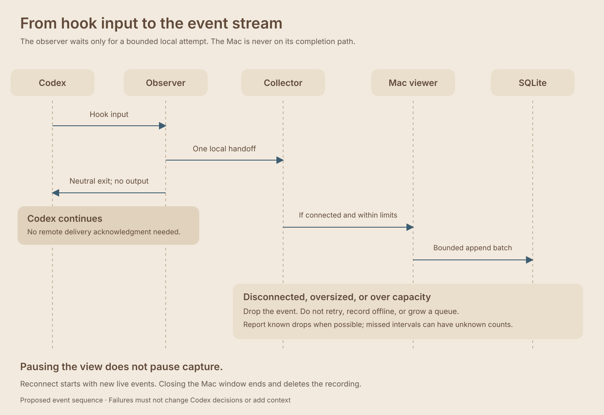

# codex-scope

## Install the server side

```sh
git clone https://github.com/alundgren/codex-scope.git
cd codex-scope
./linux/install.sh
```

Keep the pairing URL printed by the installer.

## Start the Electron app

```sh
vp i --frozen-lockfile
vp -C electron run setup
./electron/start.sh
```

Paste the pairing URL into Settings, save it, and select **Start capture**.

To run the app without a collector:

```sh
./electron/start.sh --synthetic
```

## Network topology

[](docs/diagrams/topology.svg)

## Hook sequence

[](docs/diagrams/hook-sequence.svg)

## What is codex-scope for?

Codex Scope captures Codex hook events on a Linux host and shows them in a live Electron viewer. It keeps a bounded, temporary history so you can inspect tool calls and payloads while a session is running.
