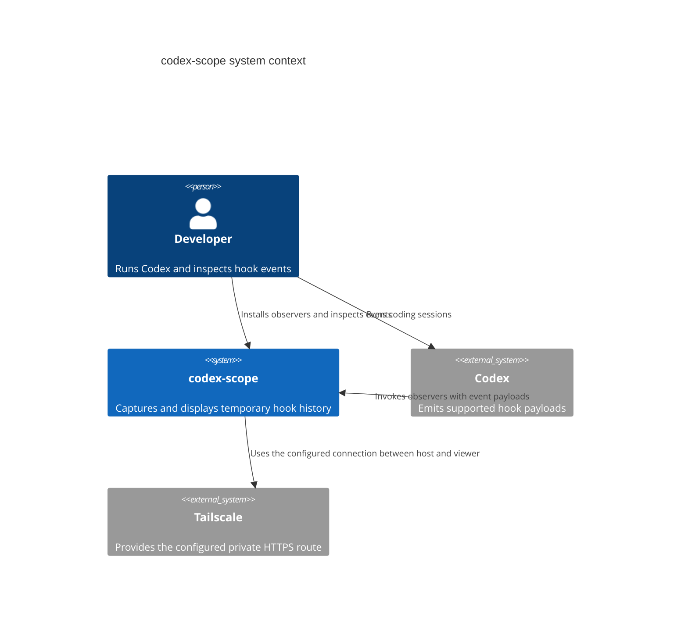
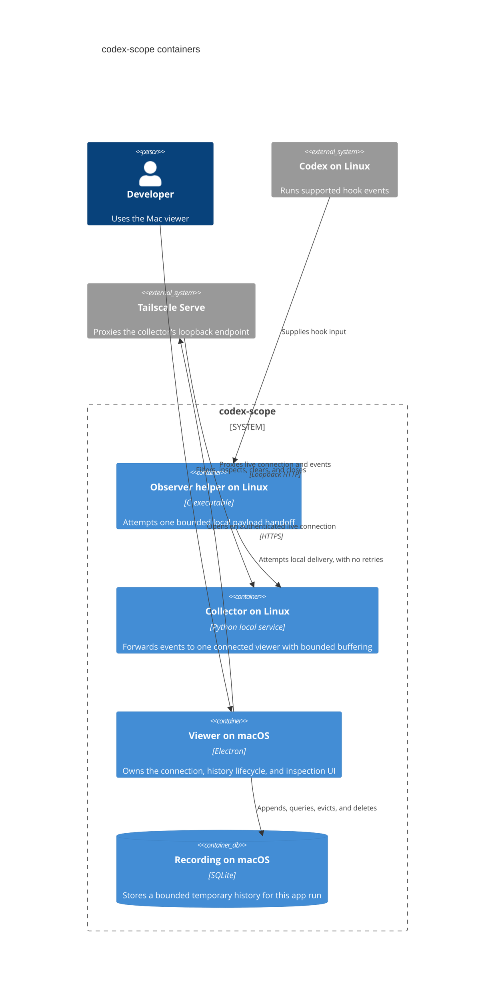

# Architecture

The Linux observer and collector and a finite Electron fixture inspector are implemented for synthetic testing. Real-session compatibility, live viewer transport, database history and macOS behavior remain unverified. The priority order is normal Codex behavior, bounded host and laptop resource use, then event retention.

## Current Electron delivery

`electron/` runs and builds independently of Linux. The main process validates
one bundled version 1 fixture recording and owns original payload text and
clipboard writes. A sandboxed preload exposes only bounded event inspection
and copying by internal ID. The isolated renderer displays neighboring event
buttons and one complete original payload as text. It uses plain local
HTML/CSS/JavaScript, a custom payload scrollbar and an allowlisted application
protocol. It adds no runtime package dependency or worker process.

The recording is finite, capped at 16 events and 256 KiB of original payloads.
The shipped five-event fixture occupies 70,623 payload bytes. Each accepted
payload is at most 61,440 bytes, as required by the shared protocol. The
renderer holds at most five summaries, one displayed payload, one in-flight
inspection and one replaceable next target. One native clipboard write may be
pending. The [Electron development guide](../electron/README.md) explains the
commands and boundaries; [Linux validation](electron-validation.md) records
the tested budgets and whole-process measurements.

The diagrams and history sections below describe the complete target system.
This slice has no transport, credentials, SQLite, search, live arrivals, scrub
navigation or Clear operation. It never records missed events. Root
`AGENTS.md` already contains the owner's recorded-visual and minimal-overhead
rules for this and later UX work.

## System context

codex-scope lets a developer inspect Codex hook payloads from a remote Linux host in a macOS viewer. The developer controls installation, the private connection, filtering, and recording lifetime.



## Containers



The [network illustration](diagrams/topology.svg) shows the physical placement. Linux ingestion uses a Unix datagram socket with account credentials in a private directory. The viewer uses a separate loopback HTTP listener. Only that HTTP listener may be proxied.

`linux/` and `electron/` own independent application tooling and tests. The shared [protocol](../protocol/README.md) defines an authenticated NDJSON stream and separate heartbeat requests, with synthetic fixtures for Mac development without the collector. The observer has no Python startup dependency; Python runs only in the collector and management tools.

## Capture contract

The observer receives only its own hook input. It does not intercept other commands or reproduce Codex's policy decisions. Current documented event names include `SessionStart`, `SessionEnd`, `UserPromptSubmit`, `PreToolUse`, `PermissionRequest`, `PostToolUse`, `PreCompact`, `PostCompact`, `SubagentStart`, `SubagentStop`, `Stop`, and `Interrupt`. This is a documentation baseline, not a claim that every Codex version, client, tool, or session emits every event. See the [official reference](https://learn.chatgpt.com/docs/hooks).

Before installing, verify the installed runtime's configuration, trust requirements, event coverage, and no-decision return behavior. Publish a tested compatibility table. An unsupported event must remain visibly unsupported rather than being simulated from transcripts. A future event requires explicit compatibility work.

The observer must:

- Have no tailnet or remote network dependency. Attempt at most one local handoff under a short measured deadline, with bounded input reading.
- Emit no stdout, context, permission decision, or stderr containing payloads. Return the verified neutral result even when collection fails.
- Drop excess or oversized data. Never retry, spool to disk, or spawn detached delivery processes per event.
- Keep dependencies and startup cost small. The executable still has a startup cost; zero added latency is not promised.

Normal configuration installs account-level observers for supported events. Installation merges with existing configuration atomically, records exact ownership, and respects Codex trust. A repeat install must not duplicate entries. Uninstall removes only unchanged entries it can prove it owns; edited or unrelated entries survive. Installed observers remain present when the viewer closes, but no recording occurs.

## Event delivery

```mermaid
sequenceDiagram
    participant C as Codex
    participant O as Observer
    participant H as Linux collector
    participant M as Mac viewer
    participant D as Temporary SQLite
    C->>O: Hook input
    O->>H: One bounded local handoff
    O-->>C: Neutral exit, no output
    Note over O,M: Observer completion never waits for the Mac
    alt Viewer connected and capacity available
        H-->>M: Event with connection ID and sequence
        M->>D: Bounded append batch
    else Disconnected or over capacity
        Note over H,D: Drop event; no offline recording or retry
    end
    Note over C,M: Capture continues while the view is frozen
```

The collector supports one active viewer. Reject a second viewer explicitly. Every connection gets a new identity and an increasing sequence within that connection. These distinguish concurrent arrivals and avoid confusing a reconnect with continuous coverage. The Mac assigns its own increasing recording order for stable history paging; remote timestamps are metadata, not a reliable total order.

A disconnect clears undelivered events. A reconnect starts with new live events and never requests missed events. Heartbeat expiry bounds how long a dead viewer can retain a queue. Report known local drops in bounded counters when possible; do not invent an exact count for an unobserved interval.

Clearing history cancels pending queries and batches, changes the recording generation, deletes the old database, and starts a fresh connection. Late results from the previous generation cannot enter the new recording.

## History and resource limits

Store original accepted payload bytes with a small envelope: local event ID, recording generation, connection ID and sequence, receive time, hook type, session ID, optional tool name, and payload byte length. Extract searchable fields without discarding unknown JSON fields. Invalid input must not crash the pipeline; skip it and count it where possible. Do not silently truncate an event and label it complete.

Both processes need limits on incoming bytes, event rate, queue bytes, queue count, and pending operations. On the Mac, database work and expensive searching belong off the renderer and must not block Electron's lifecycle handling. Rate-limit UI updates and provide a bounded number of pending database batches. When capacity runs out, drop input before allocating more work.

Use a configurable recording size budget and evict the oldest rows in small transactions. Account for the database, journal or WAL, temporary search files, and SQLite cache, not just payload lengths. Set physical growth limits and leave disk headroom. If eviction cannot keep up or a write fails, discard incoming events and keep the app responsive. Avoid full database compaction during capture. Freed pages can be reused without shrinking the file on every eviction. See [SQLite pragmas](https://sqlite.org/pragma.html) for the controls to evaluate; a database page limit alone does not bound every sidecar file.

The current viewer loads at most five visible summaries and one selected payload, with no whole-recording ID array or summary cache. Page with stable event IDs rather than increasingly large offsets. Text search covers retained payload text and metadata, using literal matching rather than executing regex. Debounce input, cancel obsolete work, and enforce query deadlines. Filtering never changes which events are captured.

Numeric defaults for bytes, timeouts, rates, and storage are implementation decisions to establish with measured overload checks in step 1 and step 3 of [the plan](../plan.md). The agreed behavior at every limit is to shed work, not expand capacity indefinitely.

The current Electron implementation uses built-in SQLite in one worker thread.
A main-process broker caps incoming frame bytes/count and outstanding requests;
only a bounded neighborhood and one payload cross into the renderer. The worker
stores both local and remote receive times and orders by local increasing IDs.
A shared generation counter stops old batches before another transaction; every
query reply also carries its generation. Clear changes that counter before
waiting for database deletion, and creates a new input connection only after
successful cleanup. Its numeric budgets and measured costs are in
[Electron history validation](electron-history-validation.md).

## Recording lifetime

| Action or failure | Required behavior |
| --- | --- |
| Open the viewer | Create one new recording in an app-owned private directory |
| Pause following or browse history | Keep recording; preserve the current view position |
| Hide or minimize the window | Keep recording |
| Mac sleeps or connection drops | Preserve received history; do not record missed remote events |
| Reconnect | Begin a new live connection; show the coverage gap |
| History reaches its budget | Evict oldest events in bounded work; show earliest retained time |
| Clear history | Discard old queues, queries, and database; start a new recording |
| Close the only window or quit | Stop intake, close database handles, delete the recording and sidecars, quit |
| Crash or force quit | Delete abandoned app-owned recordings at next launch |

Use one app instance per local recording owner. Startup cleanup must not delete an active instance's files or anything outside the app's private recording directory. A cleanup failure must be visible and handled with bounded retries; it must not hang quit indefinitely or be reported as successful deletion. Ordinary deletion does not guarantee forensic erasure, and immediate cleanup cannot be guaranteed after a crash.

## Connection and payload handling

The Mac initiates the connection. The collector's viewer API binds to loopback behind the chosen proxy. Require an application token for the viewer connection in addition to tailnet access rules; keep it out of URLs and logs. Local ingestion is restricted to the intended OS account through the chosen local transport. Do not expose ingestion through Tailscale Serve.

The Electron UI is bundled local content, with context isolation, renderer sandboxing, and no renderer Node integration. Network credentials and filesystem access stay in the main process or a narrowly scoped worker. IPC accepts only the operations needed by the viewer. Render payloads as text, never executable HTML; block arbitrary navigation and remote content. These follow [Electron's security guidance](https://www.electronjs.org/docs/latest/tutorial/security).

No telemetry, full payload logs, transcript reads, environment capture, public network publishing, or automatic export. Real connection details and screenshots stay out of the repository. The public architecture refers only to roles such as "Linux host" and "Mac viewer".

## Scope boundary

One Linux host, one Mac viewer, multiple Codex sessions, event inputs only. Historical playback, multi-host aggregation, shared viewers, hook command wrapping, durable archives, offline recording, signed distribution, and automatic updates are outside this design. Offline recording is deliberately excluded from future releases too.

Linux runtime choices, limits, and commands are recorded in [Linux development](../linux/README.md), with measured evidence in [Linux validation](linux-validation.md). SQLite integration, Mac resource limits, and complete real-session and proxy checks remain in [the plan](../plan.md).
