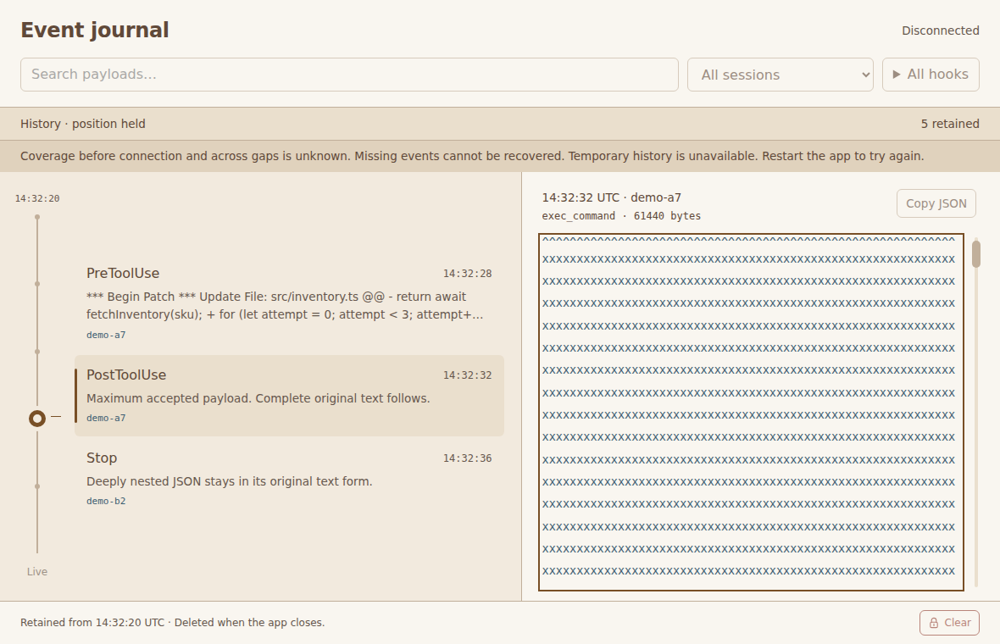
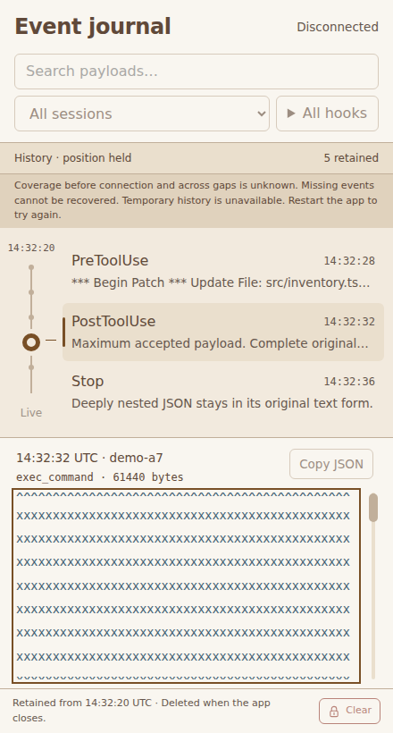

# Combined Electron review

This is historical evidence from before the Rust/TypeScript port. Commands and
tool versions below describe that earlier checkout. Current commands and evidence
are in [port validation](port-validation.md).

The final review covered the combined issues #6–9 implementation, from main
`cb7ab9e871b3317cd0e7d20ed6140a24234ae8db` through the stacked PRs #13–16.
Two defects were reproduced in actual sandboxed Electron and corrected in
the top PR. Earlier PR heads were preserved.

An old synthetic append could time out after Clear and discard newly accepted
events. The reproduction queued two events in the new recording while the old
append waited; its timeout removed both and added two local drops plus unknown
loss. `History.pump` now checks the captured generation after the worker reply
or timeout, before changing queues or counters. The regression crosses the
actual 2,500 ms request timeout with a 3,500 ms delayed reply and verifies both
new events survive. This finding concerns the synthetic broker input route;
live transport appends directly in the worker.

Worker failure left navigation, filters and Clear usable. An arrow moved the
pin without changing the payload, a search remained busy indefinitely, and
Clear erased readable text and replaced restart guidance with a busy error.
Unavailable history now disables those operations, cancels pending filter and
gesture work, and keeps the visible rows, payload and nonzero scroll position.
The main process rejects Clear after worker failure without advancing the
recording generation. The renderer adopts a generation only after main accepts
it, covering failure during Clear confirmation as well. Restart opens a fresh
recording and restores the controls.

The [before-fix reproduction](evidence/electron-final-review/before-report.json)
records both failures at `8d1a49a`. The application correction is
`275e89fd30e77b23064605f32ab6c44358ec7c53`; the complete validated source is
`0a1f8102b432aa57d12679d62d5f0b42c93c13b2`, which also corrects the new native
copy assertion. The [source receipt](evidence/electron-final-review/validated-source.json)
identifies 49 input files by SHA-256. Later documentation and evidence commits
do not change those inputs.

The source review also checked storage and sidecars, bounded requests and
queues, original accepted bytes, query cancellation, transport framing and
ordering, heartbeat liveness, distinct loss counters, private connection
configuration, capture while reading, hidden presentation, owned-file cleanup
and the absence of replay. No further supported source finding remained. These
corrections add no runtime package, process or application resource limit. The
stack does not change Linux implementation, the shared protocol or `AGENTS.md`.

Validation used Ubuntu 26.04.1 LTS, kernel 7.0.0-31-generic, two DO-Regular
virtual CPUs and 3.82 GiB RAM. It ran Electron 44.3.0 with Chromium 152.0.7977.78,
embedded Node 24.20.0 and SQLite 3.53.4; the driver used Node 24.21.0,
npm 11.19.0, Playwright 1.63.0, Xvfb and Openbox 3.6.1. The software GPU and
Chromium sandbox remained enabled. The commands and prerequisite setup are in
[integrated regression validation](electron-regression-validation.md#reproduce-from-source).
Visual recording and resource measurement ran sequentially, with no concurrent
Electron, recording or measurement workload.

The final `npm run validate:visual` passed all 22 unit checks and all 24 Electron
scenarios, with no skips, retries or flaky results. Electron scenarios took
4.6 minutes. The [test report](evidence/electron-final-review/visual-tests.json)
and [manifest](evidence/electron-final-review/visual-manifest.json) retain
109 screenshots and 30 named recordings from the corrected app. I inspected
every screenshot and one frame per second from every recording: 307 video
frames across 60 contact sheets in total, including the screenshot sheets.
I also inspected the matched desktop/narrow references and worker failure
screenshots at original size. The [inspection receipt](evidence/electron-final-review/inspection.json)
records artifact hashes and coverage. No further visual discrepancy required
a correction.

| Scenario | Corrected-app recordings and result |
| --- | --- |
| Inspect and copy original input | [Inspector](evidence/electron-final-review/walkthrough.webm), [long metadata](evidence/electron-final-review/long-metadata.webm), [oversized rejection](evidence/electron-final-review/oversized.webm): original bytes and unknown fields, hostile text, deep JSON, bounded labels, complete accepted payload and rejected oversized input. |
| Scroll and clipboard recovery | [Inspector](evidence/electron-final-review/walkthrough.webm) and [clipboard timeout](evidence/electron-final-review/clipboard-timeout.webm): thumb, track, wheel, emulated touch, keyboard, resize and one pending copy operation. |
| Filters and held arrivals | [Filters](evidence/electron-final-review/filters-walkthrough.webm), [queries](evidence/electron-final-review/queries-walkthrough.webm), [narrow controls](evidence/electron-final-review/narrow-walkthrough.webm): full session IDs, several hooks, literal full-text search, no matches, Reset and held payload offsets. |
| Navigation, eviction and timeouts | [Scrubber](evidence/electron-final-review/scrubber-walkthrough.webm), [late target](evidence/electron-final-review/late-target-walkthrough.webm), [failed navigation](evidence/electron-final-review/failed-navigation-walkthrough.webm), [retained bound](evidence/electron-final-review/retained-bound.webm): frozen gesture mapping, nearest retained match, stale replies, displayed rank and recovery. |
| Clear confirmation | [History](evidence/electron-final-review/history-walkthrough.webm): separate activations, expiry, Escape, hide, reduced motion, key repeat, empty and in-flight states. |
| Clear with old work | [Late work](evidence/electron-final-review/late-work.webm), [intake timeout](evidence/electron-final-review/intake-timeout.webm), [old timeout after Clear](evidence/electron-final-review/clear-old-timeout.webm): stale input cannot restore old data or discard new-generation events; uncertain outcomes remain distinct from known drops. |
| Failure while confirming Clear | [Clear and worker failure](evidence/electron-final-review/clear-worker-failure.webm): no generation advance, visible text and nonzero offset preserved, restart guidance retained. |
| Connection, counters and recovery | [Transport](evidence/electron-final-review/transport-walkthrough.webm), [authentication](evidence/electron-final-review/authentication-walkthrough.webm), [second viewer](evidence/electron-final-review/conflict-walkthrough.webm), [stalled storage](evidence/electron-final-review/stalled-walkthrough.webm): held reconnect, separate collector/local/unknown losses, counter reset, no replay and lease release. |
| Worker failure and restart | [Worker exit](evidence/electron-final-review/worker-exit-walkthrough.webm), [restart](evidence/electron-final-review/worker-restart-walkthrough.webm): disabled operations, canceled menu/filter work, stable selected rows/text/offset, native text copying, fresh recording and restored controls. |
| Lifecycle and cleanup | [Lifecycle](evidence/electron-final-review/lifecycle.webm), [crash recovery](evidence/electron-final-review/crash-recovery.webm), [cleanup failure](evidence/electron-final-review/cleanup-failure.webm), [cleanup recovery](evidence/electron-final-review/cleanup-recovery.webm): one owner, unrelated files preserved, hidden/native-minimized capture, close deletion and owned abandoned-file removal. |
| Isolation and startup input | [Security](evidence/electron-final-review/security.webm), [empty](evidence/electron-final-review/empty.webm), [unreadable](evidence/electron-final-review/unreadable.webm), [recovered](evidence/electron-final-review/recovered.webm): restricted Node/navigation/IPC, understandable unavailable state and restart recovery. |

| Selected reference, desktop 1180 × 760 | Corrected connected app, desktop 1180 × 760 |
| --- | --- |
|  |  |

| Selected reference, narrow 440 × 820 | Corrected connected app, narrow 440 × 820 |
| --- | --- |
|  |  |

Both pairs show the same selected patch at its beginning. Actual fixture text,
byte counts, retained totals and the required unknown-coverage notice replace
the reference's abbreviated previews and illustrative counts. The selected
typography, colors, controls, pin and narrow layout remain intact.

| Worker failure, desktop | Worker failure, narrow |
| --- | --- |
|  |  |

Native selection copying was checked after worker failure. Chromium copied the
complete JSON text except the final layout newline; the payload DOM retained
every original byte. The first full run passed 22 unit and 23 Electron tests,
then failed the new assertion that native selection copy must include that
newline. The assertion was corrected to this observed native behavior, while
keeping exact DOM-byte verification. The app's separate Copy JSON operation
retains exact-byte coverage. Its button is unavailable when the worker fails;
native selection and copying remain available for the visible payload.

One initial isolated Openbox attempt failed before the reproduction app
launched; its cause is unknown. An unchanged retry succeeded. Only the separately
launched diagnostic window manager was stopped; unrelated processes were left
untouched. The final visual suite passed in one attempt after the assertion fix.

The final `npm run validate:resources -- --runs=1` completed one fresh trial
with 208.1 seconds of measured application phases, plus its empty-window
baseline, launch and transitions. All 281 checks passed the unchanged measured
ceilings. `npm run check:resources` passed; `--prove-failure` confirmed that a
reported RSS value one byte above its ceiling is rejected. The
[raw report](evidence/electron-final-review/resource-report.json) is unchanged
from collection; [command receipts](evidence/electron-final-review/command-receipts.json)
link the logs and hashes.

| Metric | Corrected-source observation | Existing ceiling |
| --- | --- | --- |
| Startup, empty window / app | 898.6 / 1,018.9 ms | 2,000 ms |
| Peak summed RSS / largest steady RSS | 737.1 / 722.6 MiB | 900 / 825 MiB |
| Largest endpoint PSS | 385.5 MiB | 450 MiB |
| Connected / settled idle CPU | 2.12 / 1.55% of one core | 5% |
| Largest active phase mean CPU | 82.13% of one core | 110% |
| Maximum completed search / keyboard result | 432.0 / 376.3 ms | 600 / 500 ms |
| Maximum main / renderer extra timer delay | 45.8 / 90.6 ms | 250 / 250 ms |
| Cycle 3 minus cycle 1 steady RSS / endpoint PSS | -0.82 / +1.51 MiB | +16 / +8 MiB |
| Recording disk including sidecars | 8,483,506 bytes (8.09 MiB) | 33 MiB |
| Application / stock runtime files | 183,475 / 295,827,900 bytes | 200 KiB / 310 MiB |

Memory and CPU cover all Electron process-group members and descendants,
including the worker thread in its owning process. RSS counts shared pages
repeatedly; PSS is an endpoint observation, not a peak. Xvfb, Openbox, the Node
driver, fake server and aggregate-memory reader are excluded. The empty window
used 274.7 MiB PSS, connected idle 305.8 MiB, and settled idle after the complete
workload 343.9 MiB. The app keeps some allocator/renderer memory after use; this
is not a return-to-startup claim.

The run reached 10,000 small rows and then retained 135 events in each of three
300-event maximum-payload cycles. Every maximum payload was 61,440 bytes.
Evicted totals advanced 10,897 → 11,197 → 11,497; the first cycle added 93
storage drops while removing older small rows, and later cycles added none.
Cycle steady RSS was 705.87 / 705.06 / 705.05 MiB and endpoint PSS was
359.46 / 360.14 / 360.97 MiB. This shows bounded repeated eviction over the
tested workload, not a proof for unlimited duration.

Hidden and natively minimized capture each accepted 250 events with zero DOM
mutations. Sixty delayed storage events finished in 6.12 seconds. The immediate
2,000-event burst caused 937 bounded fake-server refusals; these are not called
known viewer drops. Stalled storage stopped heartbeat renewal and released the
old attempt without replay. Actual SQLite read-only/full failures and simulated
low headroom each added twelve storage drops; removing the faults resumed
capture. Failed cleanup kept only owned abandoned files for restart, and normal
close removed the recording. Final queues, request work and transport buffers
were empty. The raw report retains all 21 correctness assertions and every
phase's process, queue, disk and latency observations.

The earlier complete resource run with a 296.2 ms renderer delay against the
250 ms ceiling remains a recorded failure. Its unchanged reproduction passed;
neither that pass nor this review establishes the cause or promises every run
will pass. Both original reports remain in
[integrated regression validation](electron-regression-validation.md#fresh-source-receipt).

This is Linux synthetic development evidence. macOS performance, energy,
native lifecycle and clipboard, hardware touch/trackpad input, sleep and
occlusion remain unverified. Real Codex sessions, denying-hook compatibility,
cross-account capture and private HTTPS proxy operation are also unverified.
The separate earlier landed-collector smoke used synthetic input; this review
does not extend its claims. No real capture, private connection configuration
or token is included in these artifacts.
