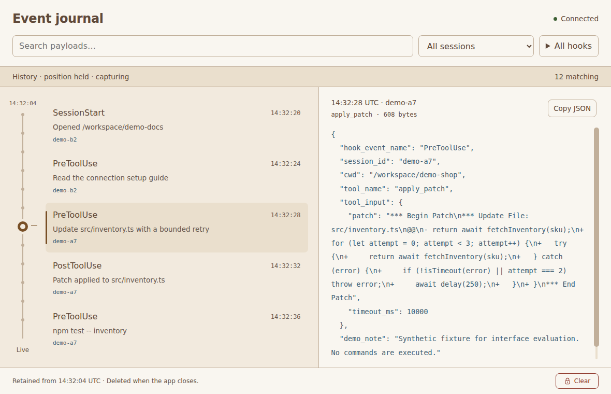
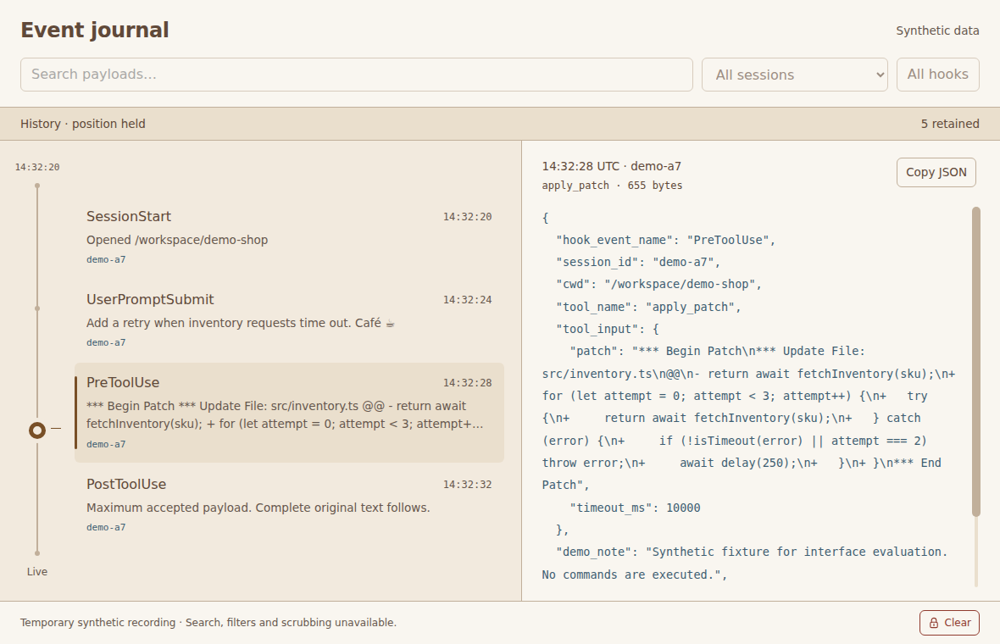
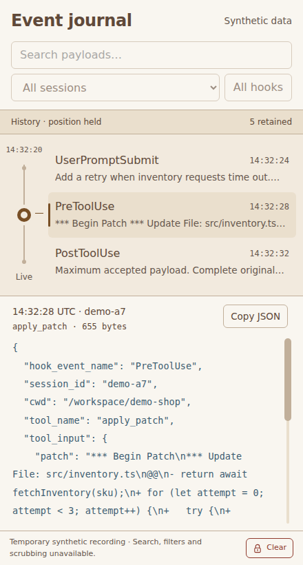

# Temporary history validation on Linux

Validated on 2026-09-11 for issue #6. Every payload, screenshot and recording
here is synthetic. The actual Electron app uses temporary SQLite history,
continuous synthetic intake, bounded nearby inspection and timed Clear.
Search, full scrub navigation and authenticated network input remain separate
issues. Linux results do not establish real Codex compatibility or macOS
performance, energy use, native window behavior, sleep or setup.

The original bare-Xvfb minimize checks below verified capture after calling
`minimize()`, but did not prove that the window became minimized. The
[integrated regression suite](electron-regression-validation.md) adds an
isolated Openbox session, requires `isMinimized()` to become true and
checks suppressed presentation during continued capture. Treat the older
minimize wording only as call-path coverage, not native minimization evidence.

## Environment and commands

Ubuntu 26.04.1 x64, Linux 7.0.0-31-generic, two DO-Regular virtual CPU cores,
3,910 MiB RAM, Xvfb at 1600 × 1000 × 24. Host Node 24.21.0 and npm 11.19.0.
The actual executable reports Electron 44.3.0, Node 24.20.0, SQLite 3.53.4
and Chromium 152.0.7977.78. Playwright 1.63.0 and its FFmpeg build 1011
record Electron windows. Rendering uses this VM's software renderer; its GPU
process stays enabled. See the [installation instructions](../electron/README.md).

```bash
cd electron
npm ci
npx install-electron
npx playwright install ffmpeg
# Configure chrome-sandbox as documented if the host requires it.
npm run build
xvfb-run -a -s '-screen 0 1600x1000x24' npm test
xvfb-run -a -s '-screen 0 1600x1000x24' npm run measure:history
```

Before review, the complete suite passed seven adapter tests and eleven actual
Electron tests. After the review fixes, all eleven existing Electron cases
passed again. The new held-retention case initially stopped on an ambiguous
test locator that matched both the event button and payload region. Restricting
the locator to the button resolved it; its recorded rerun passed. All twelve
current Electron cases have passed across that full run and focused rerun.

Visual inspection corrected a query-timeout state that retained payload text
under an empty selection label. Review also corrected the oldest-retained time
during held reading and aligned the static markers with actual visible rows.
Affected scenarios were recorded and inspected again after the corrections.

The Electron install, build and tests use no Linux application package or
collector. Shared protocol material is limited to its contract and synthetic
fixtures. Sandboxing and context isolation stay enabled; renderer Node
integration stays disabled. Each test uses its own private application owner
root. Test-only faults are available through the main-process debugger, never
through renderer IPC.

## Acceptance evidence

| Check | Result and scope |
| --- | --- |
| Original bytes and metadata | SQLite inspection and native clipboard round trips retain accepted whitespace, Unicode, unknown fields and hostile markup as text. A selected maximum payload retains all 61,440 bytes. Full session, optional tool, both receive times, connection/sequence, local ID, generation and byte count are stored. Local IDs control order. |
| Admission and working set | Oversized payloads are dropped whole. Frame bytes are checked before cloning/parsing. Delayed worker input and a burst exceed rate/queue limits without growth beyond the fixed limits. Queries return at most five summaries and one selected payload. |
| Held arrivals | Twelve arrivals leave the selected maximum payload, nonzero scroll offset and visible rows unchanged. A separate distinct-timestamp case evicts earlier rows while the selection survives: earliest retained time advances without replacing held content. Live explicitly follows the newest retained event. |
| Storage errors | Actual SQLite read-only and SQLITE_FULL errors drop input while available history remains readable. Low free-space pressure is separately simulated. Restoring writes and headroom resumes intake and clears the pressure notice. |
| Eviction | A sustained maximum-payload feed evicts the selected old row, states what happened and selects the nearest retained row. Longer measurements reach the row cap and payload-accounting cap independently and reuse database pages. |
| Timed Clear | First activation unlocks without deleting. Expiry after 3,000 ms, Escape and hiding relock. Held Enter repeats do not confirm. Reduced motion retains the same deadline. Two separate activations clear once; empty/in-flight Clear is disabled. |
| Late work | Delayed query and intake work are pending when Clear changes generation. Old input is rejected, stale query results cannot repopulate the view, and a fresh connection can add a new event. The UI confirmation path is tested separately from this precise concurrency setup. |
| Timeout and recovery | A 3,500 ms delayed intake exceeds the 2,500 ms request deadline. Its outcome is marked unknown, with no false known-drop count when it later commits. Query timeout preserves rows, metadata and payload together; selecting again after the worker recovers succeeds. |
| Cleanup failure | A simulated deletion failure leaves old files in place, clears access to their payloads, states that files remain and exits within the bounded quit check. Restart removes those owned abandoned files before creating a new recording. |
| Recording ownership | Real filesystem checks verify mode 0700 directories and mode 0600 database files. A second Electron instance exits without deleting the first instance's recording. Normal close deletes owned files. |
| Crash and unrelated files | A real SIGKILL leaves the recording. Relaunch deletes it without recovery. A settings sentinel, unrelated directory and symlink are preserved. Cleanup never follows that symlink. |
| Hidden and minimized | Real Linux hide/minimize/restore calls preserve continuous capture. Hidden status text remains unchanged while accepted counts increase; restoration refreshes presentation. This is not a Mac sleep simulation or evidence. |
| Inspector regression | Actual Electron tests retain custom wheel, pointer, track, thumb, emulated touch and keyboard scrolling; long/deep JSON; narrow resize; byte-preserving copy; native clipboard timeout/recovery; empty/unreadable/recovered fixtures; and sandbox/IPC restrictions. |

## Measured limits

The [runtime decision](electron-research.md#temporary-history-runtime-decision)
compares the exact embedded Node SQLite API with native and WASM alternatives.
Built-in SQLite adds no runtime package and needs one worker thread, included
in the main process's measured memory. Synchronous SQL, payload parsing,
filesystem accounting and deletion run there.

| Limit | Basis and behavior |
| --- | --- |
| 61,440 payload bytes; 393,216 frame bytes | Shared protocol ceilings. Maximum accepted content is fully inspectable/copyable; oversized content is rejected before payload expansion. |
| 32 queued frames and 1 MiB queued bytes | The overload test exceeds admission capacity. A sending batch has at most four frames / 512 KiB. Excess input is counted and discarded, with no replay or retry queue. |
| 256 events/s and 2 MiB frame bytes/s | Token buckets admit a short burst of 32 events / 512 KiB. The sustained workloads deliberately exceed these rates. Admission sheds excess parsing/storage work before the worker receives it. |
| Four outstanding worker requests | Ordinary work may occupy three slots, reserving one for Clear/close. A timed-out operation keeps its slot until a reply or worker exit. Renderer inspection has one in flight and one replaceable next target. |
| One unacknowledged status per recipient | Worker-to-main and main-to-renderer status updates coalesce. Renderer presentation updates are at most five per second and stop while hidden/minimized. Request replies remain bounded by the request limit. |
| Five summaries and one selected payload | Primary-key nearby queries have bounded output. There is no whole-recording ID array, payload cache or summary list in the UI. Copies and overlapping replies remain bounded by the request count and payload ceiling. |
| 10,000 rows and 8 MiB accounted retained bytes | Measurements fill the row limit with small payloads and the byte limit with maximum payloads. Byte accounting includes payload, full labels, preview and a per-row allowance. Oldest rows are evicted; these are fixed temporary-history limits, not inferred from the five seed events. |
| 64 oldest rows per input batch | Eviction uses bounded transactions. A transition from many tiny rows to maximum payloads can need more removals; that input is dropped instead of extending cleanup indefinitely. |
| 16 MiB database; 33 MiB total recording files | SQLite page count caps the database. The total allows a full rollback journal plus slack; measurements include the journal before commit and the owner file. TRUNCATE journaling reclaims sidecar length after each transaction. No WAL, disk sort file or full compaction is used. |
| 34 MiB free disk headroom | Checked before accepting a write. It reserves the full configured file budget plus slack. Low headroom drops incoming data while retained history remains readable. This check cannot prevent another application consuming disk concurrently; actual SQLite failure remains handled. |
| 2 MiB SQLite cache; 8 MiB SQLite heap | Memory mapping is disabled and temporary work stays in memory. SQLite's hard heap limit bounds its allocations. The worker's V8 old/young heaps are limited to 32/8 MiB with a 4 MiB stack; moving SQL into a worker does not remove it from total app memory. |
| 2,500 ms requests; 1,500 ms cleanup; 2,750 ms quit | Measured normal operations have substantial margin below these deadlines. Cleanup scans at most 32 root entries and five files per owned directory. Quit terminates the worker rather than waiting indefinitely; failed cleanup remains for the next startup attempt. |

SQLite uses synchronous OFF for these disposable recordings. An initial
synchronized-write experiment spent up to 345 ms in an ingestion step and
frequently filled the small queue. Disabling durability synchronization avoids
that cost because abandoned recordings are deleted without being opened or
recovered. Rollback journaling remains enabled for live write failures. A crash
may lose or corrupt the temporary database; neither the app nor the UI promises
recovery. Unknown directory content stops cleanup, preserving those files.
Ordinary deletion is not forensic erasure.

## Resource results

[Raw measurements](evidence/electron-history/measurements.json) record each
workload, process role, queue counter and version. [Initial experiment](evidence/electron-history/initial-measurements.json)
records the earlier synchronized-write behavior. The final run includes the
retained-bound and marker corrections. It uses the actual Electron app
under Xvfb without video or screenshots. All process-group members and
descendants are sampled every 250 ms. The worker is included in the main
process; the app adds no OS process. Playwright and the external sampler are
excluded. Test-driver JSON serialization in main is included, so overload CPU
also includes deliberately creating data that admission then drops.

Summed RSS counts shared pages more than once. PSS apportions them and is a
single aggregate snapshot at the end of each segment, not a measured peak.
Linux PSS collection reads restricted `/proc` counters through the existing
privileged helper, without reading memory contents or disabling the sandbox.
CPU 100% means one full core. The measurement reader adds overhead between
samples. These VM workloads establish tested limits, not Mac energy claims.

| Workload | Seconds | Mean CPU | Peak summed RSS, MiB | Final total PSS, MiB |
| --- | --- | --- | --- | --- |
| Idle before intake | 4.2 | 2.9% | 644.3 | 308.0 |
| 16,000 small inputs | 51.3 | 29.0% | 681.6 | 342.3 |
| 1,200 maximum inputs | 13.1 | 36.2% | 707.9 | 361.8 |
| 1,200 more maximum inputs | 13.1 | 43.9% | 704.9 | 359.1 |
| 2,400 more maximum inputs | 25.8 | 42.2% | 719.4 | 377.5 |
| 4,800 more maximum inputs | 51.3 | 42.0% | 720.9 | 379.8 |
| 1,000 maximum inputs in bursts | 1.6 | 51.5% | 726.1 | 382.2 |
| 400 maximum inputs while hidden | 4.7 | 19.3% | 729.7 | 386.9 |
| Idle after intake and interaction | 8.3 | 3.9% | 728.3 | 333.2 |

After reaching the retention cap, the extra 51.3-second maximum-input segment
kept 135 rows, the same accounted retained bytes and the same file-size peak.
Its final PSS was 379.8 MiB versus 377.5 MiB before that segment.
After bursts and inspection, the idle settle ended at 333.2 MiB PSS.
RSS retains reusable allocated pages; its peak across the run was
729.7 MiB. This is a short repeated-retention demonstration, not an
hours-long endurance claim.

Across 27,000 offered inputs plus five seed events, 16,681 events were
accepted and 16,546 oldest rows evicted. Admission recorded
10,185 rate drops and 0 queue-capacity drops. The worker recorded
139 storage/cleanup-capacity drops while replacing many small rows with large
rows; it recovered without relaxing its 64-row cleanup limit. The delayed-worker
functional test separately exercises queue-capacity rejection. Peak pending
intake was 18 frames and 493,656 bytes, below both fixed caps;
all queues drained between measured segments.

The database, owner file and active rollback journal peaked at
8,442,474 bytes; accounted retained data plateaued at
8,345,565 bytes. Maximum worker ingestion step time, including file
accounting and an optional bounded eviction, was 17.8 ms.
Main's 20 ms timer recorded 45.0 ms maximum extra delay during the
1,000-event serialization burst. Sustained segments recorded at most
66.6 ms extra delay. Thirty five-summary inspection requests after saturation
had p95 25.1 ms and maximum 25.1 ms, including debugger/IPC round trips.
These are query timings; recorded interaction tests separately prove displayed
payload behavior.

Startup to ready content was 1,792 ms in this run. Earlier individual
launches took 1,154 and 2,392 ms. These are warm-filesystem launches, not a
startup distribution. The original same-environment empty-window run used
274.8 MiB final PSS versus 308.0 MiB idle here. The difference includes the
inspector, synthetic seeds, worker and SQLite; it is not a controlled estimate
of SQLite alone. See [initial inspector measurements](electron-validation.md#resource-measurements)
for that baseline's methods and limits.

The application bundle is 132,467 bytes, compared with the stock Electron
runtime's 295,827,900 bytes. The dependency lock is unchanged. All npm
packages, measurement/test scripts, reference assets, screenshots and videos
remain development inputs and are excluded from the application bundle.

## Inspected visual evidence

The implementation screenshots and recordings were inspected directly. Recorded
frames were sampled every half second, alongside full-size screenshots of the
reference comparisons, held arrivals, errors, eviction and Clear. The timeout
mismatch found during that inspection was corrected. After review, the retained
bound label and static marker alignment were corrected, recorded and inspected
again in held-reading, eviction, one-event recovery and resize states.

| Reference, 1180 × 760 | Actual Electron, 1180 × 760 |
| --- | --- |
|  |  |

| Reference, 440 × 820 | Actual Electron, 440 × 820 |
| --- | --- |
|  |  |

Both comparisons select the patch at 14:32:28 UTC, session demo-a7. The unchanged
prototype's outer demo frame and controls are omitted at capture time to compare
application content at equal sizes. The actual fixture preserves an unknown
field, so its original byte count differs. The implementation has three to five
nearby rows, a static selection pin, disabled filters, Synthetic data status
and enabled Clear/Live. These partial-delivery differences follow [ux.md](../ux.md).

| Recording | Scenarios |
| --- | --- |
| [History walkthrough](evidence/electron-history/history-walkthrough.webm) | Matching desktop/narrow states, held maximum payload during arrivals, oversized drop, read-only/full-database/low-headroom pressure and recovery, selected-event eviction, Live, Clear unlock/expiry/Escape/held key/reduced motion/confirmation, empty and fresh input. |
| [Retained bounds](evidence/electron-history/retained-bound.webm) | Older rows are evicted while the selected event, its neighbors and nonzero payload offset stay fixed; earliest retained time advances. |
| [Late work](evidence/electron-history/late-work.webm) | Intake drops, delayed requests, Clear generation change, rejection of old work, fresh-session recovery. |
| [Cleanup failure](evidence/electron-history/cleanup-failure.webm), [restart recovery](evidence/electron-history/cleanup-recovery.webm) | Explicit failed deletion, inaccessible old payload, bounded close, successful startup cleanup. |
| [Lifecycle](evidence/electron-history/lifecycle.webm), [crash recovery](evidence/electron-history/crash-recovery.webm) | Second instance, hidden/minimized capture, relocking on hide, force kill, restart and owned-file cleanup. |
| [Intake and query timeout](evidence/electron-history/intake-timeout.webm) | Unknown intake outcome, later arrival without false known drops, preserved display on query failure, successful retry. |
| [Inspector walkthrough](evidence/electron-history/inspector-walkthrough.webm) | Original copy, rejection/recovery, maximum/deep payloads, all custom-scroll inputs, retained offset through desktop/narrow/minimum resize, keyboard selection. |
| [Clipboard timeout](evidence/electron-history/inspector-clipboard-timeout.webm), [security](evidence/electron-history/inspector-security.webm) | Bounded pending native write and recovery; isolated local window remains usable after prohibited operations. |
| [Long metadata](evidence/electron-history/inspector-long-metadata.webm), [oversized](evidence/electron-history/inspector-oversized.webm) | Complete text with bounded labels at minimum width; rejected oversized input leaves valid history usable. |
| [Empty](evidence/electron-history/inspector-empty.webm), [unreadable](evidence/electron-history/inspector-unreadable.webm), [recovered](evidence/electron-history/inspector-recovered.webm) | Empty state, failed initial input and recovery after restoring the source and restarting. |

Full-size states include [held arrivals](evidence/electron-history/held-arrivals.png),
[storage full](evidence/electron-history/sqlite-full.png),
[eviction](evidence/electron-history/eviction.png),
[Clear unlocked](evidence/electron-history/clear-unlocked.png),
[Clear empty](evidence/electron-history/clear-empty.png),
[cleanup failure](evidence/electron-history/cleanup-failed.png),
[query timeout](evidence/electron-history/query-timeout.png) and
[query recovery](evidence/electron-history/query-recovered.png).
