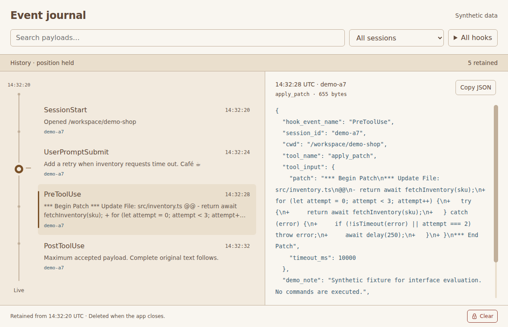
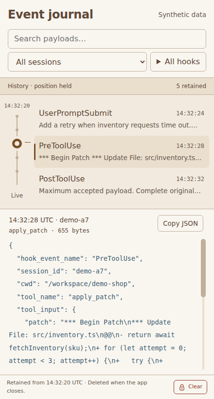

# Search and navigation validation on Linux

This is historical evidence from before the Rust/TypeScript port. Commands and
tool versions below describe that earlier checkout. Current commands and evidence
are in [port validation](port-validation.md).

Validated for issue #7 on 2026-09-11. All inputs and evidence are synthetic.
The actual Electron app searches temporary SQLite history while intake
continues. Full accepted text and metadata use case-insensitive literal
matching. Session filters compare complete identifiers, and hook choices allow
several selections. The vertical slider navigates matching events in recording
order and has a separate Live endpoint.

Real collector input belongs to the transport issue. Linux results do not
establish real Codex compatibility or macOS performance, energy use, native
window behavior, sleep or setup.

## Environment and verification

Ubuntu 26.04.1 x64, Linux 7.0.0-31-generic, two DO-Regular virtual CPU cores,
3,910 MiB RAM, Xvfb at 1600 × 1000 × 24. Host Node 24.21.0 and npm 11.19.0.
The app reports Electron 44.3.0, Node 24.20.0, SQLite 3.53.4 and Chromium
152.0.7977.78. Playwright 1.63.0 and FFmpeg build 1011 are development tools.
The VM uses software rendering with Electron's GPU process enabled. Sandboxing,
context isolation and background throttling remain enabled.

```bash
cd electron
npm ci
npx install-electron
npx playwright install ffmpeg
# Configure chrome-sandbox as documented in electron/README.md if required.
npm run build
xvfb-run -a -s '-screen 0 1600x1000x24' npm test
xvfb-run -a -s '-screen 0 1600x1000x24' npm run measure:navigation
```

All eleven unit tests passed, including cancellation during an executing
SQLite scan. After the review corrections, all six navigation cases passed.
They cover delayed eviction replies and failed moves followed by arrow and
Live recovery. The twelve inspector/history cases passed in the earlier full
run. All eighteen current actual Electron cases have passed across those full
and focused runs. Existing cases cover byte-preserving copy, payload scrolling,
admission/storage failures, Clear, cleanup, hidden capture and the sandbox.
No Linux application package, collector, hook installation or private proxy
is needed.

## Acceptance evidence

| Check | Result |
| --- | --- |
| Literal and metadata search | Case-insensitive text matches outside previews, including literal `[a.*]%_`, with no regular-expression execution. Metadata searches cover hook, complete session and tool identifiers, both receive times, connection identifier, sequence and payload byte count. Retained matches and accepted-arrival counts share one predicate. |
| Full IDs and hook combinations | Sessions with the same visible prefix remain distinct. Two hook selections combine with session and text filters. Pages contain at most 32 complete values and 128 KiB. A narrow-window case pages long identifiers through the byte limit. |
| Filter changes | A still-matching selection survives; otherwise the nearest matching local ID is selected. Delayed obsolete filters never replace the latest results. No matches clears payload selection and offers Reset filters. The first later matching arrival becomes available. |
| Held reading | Arrivals preserve selected ID, visible rows, full payload and nonzero scroll offset. The new-event count includes only current matches. Changing filters, selecting Live and Clear reset it; selecting another history row does not. |
| Scrub inputs | Pointer and emulated touch move in both directions. Journal wheel, row buttons, all arrows, Page Up/Down by five, Home and End work. Newest history remains held; the separate Live stop follows arrivals. Named slider values and focus reflect selection. |
| Frozen gestures | The matching count, retained upper ID and pixel endpoints stay fixed during a gesture. New arrivals do not alter its mapping. Matching eviction ends an unusable gesture with an explanation, then resolves the nearest retained match. |
| Stale results | Recording generation, query and target identities reject obsolete replies. A late successful query cannot display a now-evicted selected event or neighborhood. Clear discards older pending work and starts a new recording. |
| Failed navigation | A timed-out Home or End move restores the last successfully displayed rank and viewing mode. The retained payload is explicitly identified. Arrow recovery starts from that event, and a failed Live request preserves the held matching-arrival count. A delayed request keeps the journal busy until its selected payload has updated. |
| Cancellation and timeout | A separate worker changes the shared target during an executing 10,000-row SQLite scan and interrupts it. A forced query deadline shows an editable query, identifies the retained previous selection and offers Reset filters. Reset recovers at desktop and narrow sizes. |
| Retention and pressure | Selected-event eviction explains the loss, updates the earliest retained time and leaves navigation usable. Simulated disk pressure drops incoming events while history remains readable. Restoring headroom resumes capture. |

## Query and working-set limits

The existing worker owns SQLite, search and arrival matching. The renderer has
one request in flight and one replaceable target. An eight-byte shared buffer
holds recording generation and requested target. Changing either cancels a
scan without waiting for the worker's event loop. SQL invokes the literal
predicate as it visits rows; that function checks cancellation and elapsed time.
The complete navigation request has a 250 ms deadline, including its count,
selection and nearby-row queries.

The [Node SQLite API](https://r2.nodejs.org/docs/latest-v24.x/api/sqlite.html)
provides synchronous database calls, JavaScript SQL functions and row iteration.
Its database `timeout` covers locks, so it does not replace the query deadline.
Keeping those calls in the existing worker follows
[Electron's performance guidance](https://www.electronjs.org/docs/latest/tutorial/performance)
to measure all processes and keep expensive work off the main and renderer
threads. This change adds no runtime dependency or OS process.

| Limit | Basis and behavior |
| --- | --- |
| 512 search characters, 32 selected hooks, 128 KiB filter bytes | Complete values stay bounded before worker work. Filters reject an additional selection that exceeds the combined budget. Search is literal, with Unicode lowercase comparison and no regex compilation. |
| 180 ms typing debounce, one running and one replaceable navigation | Rapid input cancels the preceding target immediately. Pointer movement coalesces to animation frames; journal wheel steps at most once per 80 ms. |
| 250 ms navigation deadline | Measured against growth to 10,000 small retained rows, a second retention cycle and maximum payloads. A stopped scan returns no partial matching results. The editable query and Reset filters remain available. |
| Five summaries, one selected payload, 64 visual ticks | SQL returns a bounded neighborhood. Rank lookup uses an offset within the existing 10,000-row retention limit. There is no whole-recording ID array, sparse index or matching-payload cache. |
| 32 choice values and 128 KiB per page | Two database indexes support keyset paging of full session and hook values. Six prepared statements are reused. The UI retains the current pages plus selected values, with one choice request in flight and at most one pending request per field. |
| One count and arrival/removal scalars per active query | Successful count results are updated by the same predicate on committed arrivals and removals. Arrival and removal counters saturate at the safe integer limit. Held arrival baselines reset when the filter or viewing mode changes. |
| Existing history budgets | Four total broker requests, 10,000 rows, 8 MiB accounted retained data, 16 MiB database, 33 MiB total recording files, 2 MiB SQLite cache and 8 MiB SQLite heap remain unchanged. Index pages share these limits. See [history validation](electron-history-validation.md#measured-limits). |

Filter-choice index traversal is bounded by the retained row count and the
broker request deadline. It does not read payload text. Search and navigation
use the shorter per-row cancellation and 250 ms checks. A capture burst can
still lose events while the worker is busy; that is the intended best-effort
policy, with fixed queue and drop counts.

## Resource measurements

[Raw measurements](evidence/electron-navigation/measurements.json) include every
segment, process role, timing and version. This run includes the review fixes
and corrected completion checks. It used the actual app under Xvfb without
recording or concurrent tests. All Electron process-group members and
descendants were sampled every 250 ms, including the database worker inside
main. Playwright and the sampler are excluded. Main includes synthetic input
serialization.

Summed RSS counts shared pages more than once. PSS apportions shared pages and
is one aggregate snapshot at each segment's end, not its peak. The existing
privileged helper reads Linux aggregate memory counters only. CPU 100% means
one full core. These short VM measurements do not establish endurance or Mac
energy behavior.

| Workload | Seconds | Mean CPU | Peak summed RSS, MiB | Final PSS, MiB |
| --- | --- | --- | --- | --- |
| Idle before intake | 4.3 | 3.5% | 646.8 | 312.4 |
| 1,000 small inputs | 5.8 | 27.2% | 663.9 | 327.0 |
| Navigation after 1,000 | 12.0 | 82.2% | 760.5 | 417.0 |
| 2,000 more small inputs | 11.7 | 24.9% | 760.3 | 337.9 |
| Navigation after 3,000 | 15.2 | 74.5% | 711.8 | 369.4 |
| 7,000 more small inputs | 40.5 | 23.1% | 713.4 | 365.0 |
| Navigation at 10,000 rows | 13.0 | 90.3% | 715.4 | 371.8 |
| 10,000 more small inputs | 58.1 | 40.3% | 716.2 | 372.5 |
| Navigation after capped repeat | 13.8 | 91.5% | 719.3 | 375.7 |
| 240 maximum inputs | 16.3 | 29.0% | 727.5 | 382.8 |
| Navigation through maximum payloads | 19.6 | 88.7% | 778.0 | 392.5 |
| Settled idle | 6.3 | 0.2% | 737.3 | 385.1 |

Each navigation segment performs ten search changes, ten keyboard moves and
240 pointer moves. Search timings include the 180 ms debounce and driver/IPC
costs. Keyboard timings include driver/IPC, the expected selected ID, a
completed journal update and the next animation frame. The initial Home
request settles before the measured keys begin. Every operation checks for
successful completion. With ten observations, the reported p95 is also the
maximum. The earlier optimistic-slider timing was invalid and is replaced here.

| Retained population | Longest displayed search | Longest keyboard move | Worker navigation maximum so far |
| --- | --- | --- | --- |
| 1,005 rows | 368.4 ms | 139.9 ms | 22.6 ms |
| 3,005 rows | 404.8 ms | 147.5 ms | 84.1 ms |
| 10,000 rows | 444.5 ms | 150.6 ms | 91.9 ms |
| 10,000 after another retention cycle | 402.6 ms | 200.5 ms | 129.1 ms |
| 135 maximum-payload rows | 470.6 ms | 176.1 ms | 165.0 ms |

The longest complete worker navigation was 165.0 ms, below the 250 ms
deadline. Rapid input canceled 281 obsolete targets; there were
0 natural search timeouts. Fault tests separately prove timeout behavior.
Peak pending broker requests were 2 of four allowed, with no pending requests
or intake remaining between segments. The UI contained three or four event
summaries and 64 sampled tick nodes throughout navigation.

After a second 10,000-input cycle, history still had 10,000 rows. Final PSS
after navigation was 375.7 MiB, compared with
371.8 MiB before that cycle. Maximum-payload replacement retained
135 rows and 8,345,565 accounted bytes. The database, owner file and
active journal peaked at 8,471,202 bytes. Across 20,240 offered inputs
plus five seeds, 20,159 events were accepted and 20,024 rows evicted. The
worker dropped 86 inputs during the small-to-large transition because the fixed
64-row cleanup step could not immediately free enough space. There were no
rate or queue-capacity drops, and pressure recovered.

The main 20 ms timer recorded at most 170.9 ms extra delay. The renderer timer
recorded at most 155.0 ms; navigation segments peaked at 155.0 ms. These pauses
are included in the result, not hidden behind average latency. Maximum worker
intake time was 32.9 ms. Settled idle used
0.2% of one core. No long-duration, hardware-GPU, macOS or battery test is
claimed.

Startup to ready content was 1359 ms in this warm-filesystem run.
The application bundle is 162,091 bytes, compared with the stock
Electron runtime's 295,827,900 bytes. The dependency lock is unchanged.
Test tools, measurements, reference assets and recordings are excluded from
the shipped app. The earlier [history measurements](electron-history-validation.md#resource-results)
provide the prior delivery's resource context; separate runs do not isolate the
exact cost of search alone.

## Recorded experience

The final screenshots and recording frames sampled once per second were inspected directly.
Visual inspection found an incorrect oldest-time label after filtering; the
rail now uses the earliest matching event while the footer always reports the
earliest retained event. The affected recordings passed again. A later race
check found that a successful query could arrive after its target was evicted;
the renderer now resolves current retained rows before display. Review also
found optimistic slider movement persisting after a timeout and an early
keyboard timing endpoint. Failed moves now restore the displayed position and
mode. The corrected timing script waits for the selected payload and completed
journal update, and its isolated workload was rerun.

| Reference, 1180 × 760 | Actual Electron, 1180 × 760 |
| --- | --- |
|  |  |

| Reference, 440 × 820 | Actual Electron, 440 × 820 |
| --- | --- |
|  |  |

Both comparisons select the patch at 14:32:28 UTC in session demo-a7. The
unchanged prototype's outer demo controls are omitted during reference capture.
The app has five seed events and preserves original JSON, including an unknown
field; the prototype has twelve demo events and formatted example text. The
app's slider maps its complete retained matching range, so its pin can differ
from the prototype's row-centered demo marker. The header says Synthetic data
until transport is implemented. These delivery details are recorded in
[ux.md](../ux.md); the selected colors, controls and simultaneous journal/payload
layout remain intact.

| Recording | Scenarios |
| --- | --- |
| [Filters](evidence/electron-navigation/filters-walkthrough.webm) | Matching desktop/narrow reference states, literal full payload and metadata searches, colliding full session IDs, multi-hook selection, held payload offset, identical matching counts, nearest selection, no matches, Reset and Live. |
| [Scrubber](evidence/electron-navigation/scrubber-walkthrough.webm) | All keyboard, pointer, touch, wheel and row inputs in both directions; newest history versus Live; arrivals during a frozen drag; selected/gesture eviction, pressure and narrow recovery. |
| [Queries](evidence/electron-navigation/queries-walkthrough.webm) | Delayed rapid filters, obsolete target rejection, cancellation, timeout/reset, pending Clear generations, paged sessions and the first later matching arrival. |
| [Narrow failures](evidence/electron-navigation/narrow-walkthrough.webm) | Long full-ID choice pages, a held filtered payload at nonzero offset, timeout/reset, selected-event eviction, storage pressure and recovery at 440 × 820. |
| [Failed navigation](evidence/electron-navigation/failed-navigation-walkthrough.webm) | Timed-out Home and End restore the displayed event, rank, mode and held arrival count; arrow and Live recover; a delayed Live request finishes only when its payload is displayed. |
| [Late eviction](evidence/electron-navigation/late-target-walkthrough.webm) | A completed database query is delayed while its requested target is evicted; the UI explains the loss and displays only retained rows. |

Full-size states include [held filtered arrivals](evidence/electron-navigation/held-filtered-arrivals.png),
[multiple hooks](evidence/electron-navigation/multiple-hooks.png),
[no matches](evidence/electron-navigation/no-matches.png),
[search timeout](evidence/electron-navigation/search-timeout.png),
[gesture eviction](evidence/electron-navigation/gesture-evicted.png),
[narrow timeout](evidence/electron-navigation/narrow-timeout.png),
[narrow recovery](evidence/electron-navigation/narrow-recovered.png) and
[late target recovery](evidence/electron-navigation/late-evicted-target.png).
