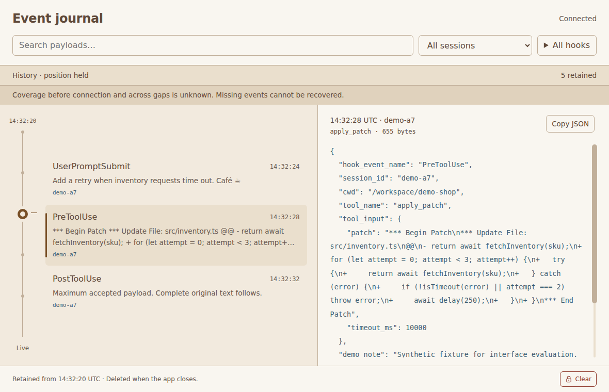

# Integrated Electron regression validation

The independent viewer checks run the production `dist/app` in actual Electron
under Linux Xvfb. They use deterministic synthetic fixtures and a bounded fake
collector. The standard suite needs no Linux application, account hook, private
configuration, trust change or proxy. The real collector smoke remains a
separate optional command.

## Reproduce from source

See [Electron prerequisites](../electron/README.md#clean-linux-checkout) for the
pinned runtime, shared libraries and sandbox-helper setup. The test display also
needs `openbox` and `xprop`, normally installed on Ubuntu with
`sudo apt-get install --no-install-recommends openbox x11-utils`. From a fresh source
checkout:

```bash
cd electron
npm ci
npx install-electron
npx playwright install ffmpeg
# Only where restricted user namespaces require the supplied sandbox helper:
sudo chown root:root node_modules/electron/dist/chrome-sandbox
sudo chmod 4755 node_modules/electron/dist/chrome-sandbox
setsid --wait xvfb-run -a -s '-screen 0 1600x1000x24' npm run validate:visual
setsid --wait xvfb-run -a -s '-screen 0 1600x1000x24' npm run validate:resources
npm run check:resources
npm run check:resources -- --prove-failure
```

The Electron test and resource commands start Openbox on their supplied Xvfb
display using a temporary explicit configuration. They refuse to replace an
existing window manager, wait for its X11 readiness marker, and terminate only
the manager they spawned. The external window manager is excluded from app
resource totals and is never shipped. Run these commands on an unused Xvfb
display.

Run the visual and resource commands sequentially with no other Electron test,
recording or measurement workload. Both commands rebuild `dist/app`. The visual
command runs unit checks and the existing Playwright Electron suite, captures
the unchanged mockup, and writes `validation/visual/manifest.json` plus named
screenshots and recordings. It also retains the Playwright JSON report. A test
failure exits nonzero and keeps available artifacts. An automated pass requires
human inspection of the recordings before it establishes visual acceptance.

The resource command runs three fresh empty-window/app trials. To reproduce a
single trial, append `-- --runs=1`. It writes
`measurements/regression/report.json`; `report.partial.json` records the active
phase and completed phases even when execution fails. `--calibrate` records
measurements without accepting the performance thresholds. Fixed application
bounds and correctness assertions remain enforced. Calibration is for reviewing
new evidence, not for silently updating the checked-in thresholds.

`check:resources` reevaluates an existing report and exits nonzero for missing
phases, unavailable required memory measurements or exceeded thresholds.
`--prove-failure` changes one reported RSS measurement in memory to one byte over
the ceiling and verifies rejection. It does not rewrite the report or allocate
excess memory. The synthetic workload separately proves real input dropping,
lease release and recovery under burst and stalled-consumer conditions.

All cleanup targets only the launched app, its fake server and its private
`mkdtemp` owner root. It never scans for or kills other worktrees' processes.
Signal interruption writes a partial report with the signal and exits with its
signal status. The earlier feature measurement exits of 143 remain unexplained;
they are not evidence of a particular process cleanup failure.

Linux PSS access can be restricted for sandboxed children. The existing sampler
first reads `/proc` directly, then tries `sudo -n` for a Python reader that reads
only aggregate `smaps_rollup` counters. It never reads process memory contents.
If that reader is unavailable, RSS still appears, PSS is null and the complete
resource check fails explicitly. The app remains sandboxed. Configure this
measurement capability on the validation machine or report PSS as blocked.

For configured collector mode, use the private placeholder configuration in
[Electron development](../electron/README.md#collector-connection). To run the
landed collector with isolated synthetic ingestion:

```bash
setsid --wait xvfb-run -a -s '-screen 0 1600x1000x24' npm run test:collector
```

That optional command needs Python and the independent Linux collector files.
It is outside both standard validation commands and never imports Linux code.

## Measurement definitions

The report records OS/kernel, CPU model/count, installed RAM, available RAM,
host Node/npm, embedded Electron/Node/Chromium/V8/SQLite, GPU configuration,
application bytes and runtime bytes. The empty window and app use equal content
size, sandboxing, context isolation and background throttling. Filesystem caches
stay warm. These are fresh processes, not cold-machine startup tests.

| Metric | Definition |
| --- | --- |
| Summed RSS | Resident pages from `/proc` for the Electron process group and all descendants, sampled with 250 ms waits plus reader overhead. Shared pages are counted more than once. |
| Steady RSS | Median RSS in the final third of a phase's samples. |
| PSS | One aggregate endpoint snapshot that apportions shared pages, never a peak. |
| CPU | User and system ticks divided by actual monotonic sample duration. 100% means one full core. Reported by process role as well as app total. Children created and exited between samples may be missed. |
| Startup | Driver launch through ready app, Connected for configured input, and two completed animation frames. |
| Visible result latency | Input start through completed journal update, matching selected row/payload/slider, successful result and following animation frame. Search includes its 180 ms debounce. Empty results require no selected row. |
| Timer delay | Maximum extra delay beyond a 20 ms diagnostic timer in main and renderer. The timers run only in active measured phases, not idle or hidden phases. |
| Disk | Worker maximum of every recording file, including owner marker and rollback journal during transactions. An independent phase-end directory count corroborates it. SQLite uses in-memory temporary work under its heap cap. |
| Pending work | Main broker's current/peak queue count, bytes and requests; transport frame/chunk maximum, one processing slot and request/retry state. Worker threads remain included in their owning process's memory/CPU. |
| Drops | Viewer storage/rate/queue totals, transport rate disconnections and fake-server refusals are separate. Counters reset with Clear/restart. Unobserved losses remain unknown; offered minus retained is not called a known-drop count. |

Xvfb, Openbox, Playwright, the Node driver, the fake server and aggregate-memory reader
are excluded from app totals. Recording never runs during measurement. No heap
number is presented as total application memory.

The combined workload starts empty, seeds the five fixtures, reads a maximum
payload at a nonzero offset during 120 arrivals, grows through 1,000 inputs to
the 10,000-row limit and navigates at both sizes. It combines rapid filters and
pointer moves with capture, then feeds three 300-event maximum-payload cycles.
Each maximum payload is 61,440 accepted bytes. Small inputs contain full session
IDs, literal regex punctuation and alternating matches. Remote timestamps are
fixed and reverse with generated indexes, so local order is tested separately.
The report records each phase's offered count, pacing, elapsed duration,
written frame bytes and server refusals rather than claiming the nominal rate
was achieved exactly.

Later phases measure hidden/minimized capture with a DOM mutation observer and a native `isMinimized()` check,
100 ms storage delay, a 2,000-event immediate burst, a 6,500 ms stalled event,
real SQLite read-only and full errors, simulated low free space, recovery,
settled idle, failed cleanup and fresh restart. Phase completion uses a debugger-only request for the worker's current processing
slot and response buffer, together with main queue/request counts. Coalesced UI
status can be stale while a chunk is still processing and is not a completion
signal. The delayed phase also requires all sixty events accepted and at least
six seconds elapsed before removing the 100 ms per-event fault. Diagnostic
requests add bounded work to the measured process. No fault installs a growing
work queue. The stall verifies that heartbeat renewal stops; the burst verifies
refusal or rate disconnection. Restart and normal close check owned files.

The setup runs exposed validation errors that were kept with their logs and
partial reports. One treated the empty payload ID as a real selection; one
maximum-history query failed before its notice was captured, so its cause
remains unproven. Two others used bare-Xvfb minimization or document visibility
as an invalid stand-in for native window state. A fifth preliminary run ended
its delayed-storage phase early by trusting coalesced status. It is excluded
from the final measurements. The completed current-source trials use the direct
worker completion checks described above; no application limit was relaxed to
accept these setup failures.

## Recorded runs and regression ceilings

The three complete trials ran on 2026-09-12 in an Ubuntu 26.04.1 LTS VM with
kernel 7.0.0-31-generic, two DO-Regular virtual CPUs and 3.82 GiB RAM. The
runtime was Electron 44.3.0, embedded Node 24.20.0, Chromium 152.0.7977.78,
V8 15.2.124.19 and SQLite 3.53.4; the driver used Node 24.21.0/npm 11.19.0,
Playwright 1.63.0 and Openbox 3.6.1. The software GPU remained enabled.
Each trial contained 210.1–214.9 seconds of measured application phases,
plus its empty baseline, launch and transitions. No recording or other app
workload ran concurrently.

The [resource report](evidence/electron-regressions/resource-report.json)
contains every phase, offered/written/refused input count, process role,
queue/cache/storage limit and correctness assertion. Its measurements are
unchanged from collection. `collectionEvaluation` preserves the initial
candidate ceilings; `evaluation` applies the final measured ceilings below.
All 839 checked values pass those final ceilings.

| Phase | Measured seconds | Peak summed RSS, MiB | Endpoint PSS, MiB | Mean app CPU, % of one core |
| --- | --- | --- | --- | --- |
| `baselineIdle` | 4.2–4.3 | 632.5–637.6 | 280.5–282.2 | 0.0–0.2 |
| `connectedIdle` | 4.1–4.2 | 674.0–674.9 | 310.1–312.3 | 2.4–2.6 |
| `heldCapture` | 1.3 | 693.2–696.5 | 327.5–329.4 | 32.7–38.1 |
| `capture1000` | 7.0–7.4 | 696.0–699.6 | 330.4–332.6 | 40.1–42.7 |
| `navigate1000` | 8.1–8.8 | 758.4–763.0 | 386.7–389.5 | 71.5–82.1 |
| `captureToRowLimit` | 63.9–65.2 | 759.7–765.4 | 353.5–356.2 | 38.7–43.1 |
| `navigateRowLimit` | 9.1–12.0 | 731.7–738.9 | 360.4–363.3 | 69.0–87.7 |
| `captureAndRapidInput` | 3.5–4.1 | 735.9–740.0 | 359.7–364.1 | 63.7–71.6 |
| `maximumCycle1` | 20.3–20.4 | 737.7–743.8 | 359.5–368.0 | 28.5–32.7 |
| `maximumCycle2` | 20.2–20.5 | 735.4–741.6 | 362.5–368.8 | 35.3–36.3 |
| `maximumCycle3` | 20.2–20.5 | 735.8–742.5 | 363.1–369.0 | 35.5–40.2 |
| `navigateMaximum` | 11.9–13.3 | 778.5–800.0 | 385.4–386.3 | 82.7–87.0 |
| `hiddenCapture` | 3.5–3.6 | 759.1–761.7 | 375.1–387.3 | 16.1–16.9 |
| `minimizedCapture` | 3.5–3.6 | 744.4–753.0 | 372.7–381.5 | 15.4–16.3 |
| `delayedStorage` | 6.1–6.3 | 740.3–754.6 | 368.9–379.6 | 25.6–27.5 |
| `burst` | 3.9–4.2 | 746.3–751.9 | 372.8–379.2 | 13.4–15.9 |
| `stalledStorage` | 8.7–8.8 | 745.9–749.9 | 363.6–363.9 | 4.4–4.7 |
| `readOnly` | 1.2–1.3 | 735.5–739.4 | 362.0–366.3 | 12.0–13.4 |
| `diskHeadroom` | 1.3–1.4 | 735.0–739.7 | 361.7–367.2 | 9.5–11.4 |
| `sqliteFull` | 1.2–1.3 | 734.6–740.7 | 361.8–367.7 | 11.7–17.4 |
| `recoveredCapture` | 2.0–2.1 | 741.5–742.4 | 366.0–369.1 | 40.2–42.3 |
| `settledIdle` | 5.2–5.3 | 741.5–742.6 | 362.3–365.4 | 1.9–2.8 |
| `cleanupFailure` | 0.6–0.7 | 739.0–740.0 | 365.1–367.8 | 14.1–16.8 |
| `restartRecovery` | 0.9–1.1 | 664.8–671.4 | 307.9–310.0 | 19.7–28.1 |

The empty-window baseline used 280.5–282.2 MiB PSS. Connected idle used
310.1–312.3 MiB PSS, about 30 MiB more. After the full workload, settled idle
used 362.3–365.4 MiB PSS. That retained allocator/renderer working set is visible
in the report; it is not described as returning to its startup value.

All three maximum-payload cycles retained exactly 135 events per trial.
Evicted totals advanced 10,897 → 11,197 → 11,497 while 900 maximum-size events
were offered. The first cycle dropped 93 events while the bounded eviction
work removed the earlier small rows; later cycles added no storage drops.

| Trial | Cycle 1/2/3 steady RSS, MiB | Cycle 1/2/3 endpoint PSS, MiB | Final minus first RSS/PSS, MiB |
| --- | --- | --- | --- |
| 1 | 739.1/738.8/739.6 | 368.0/368.8/369.0 | +0.52/+0.94 |
| 2 | 735.8/735.0/735.1 | 365.2/365.0/366.0 | -0.77/+0.81 |
| 3 | 733.1/732.2/733.3 | 359.5/362.5/363.1 | +0.27/+3.66 |

These repeated eviction cycles show a plateau over this workload, not a proof
about unlimited run duration. Main intake queue occupancy and bytes ended at
zero throughout live transport; at most two broker requests and one transport
event were active. The fixed synthetic intake tests separately fill the broker
queue to prove its 32-event/1-MiB cap. The final transport buffer and all pending
queues were empty in every trial.

Each immediate 2,000-event burst caused exactly 937 bounded-server refusals.
That count belongs to the fake server; it is not presented as a known viewer
loss total. Stalled processing stopped heartbeat renewal, discarded its old
attempt and recovered without a replay request. All sixty 100-ms delayed events
completed in 6.11–6.16 seconds of workload time, replacing the earlier premature
0.7-second diagnostic result. SQLite read-only/full and simulated headroom
failures increased storage-drop counts; clearing the faults resumed intake.
Failed cleanup left owned files for the restart check; normal close removed them.
Hidden and natively minimized capture each accepted 250 events with zero DOM
mutations in all three trials. The resource report records both native state
and the separate document-visibility observation.

The following ceilings come from the largest observed values across the three
trials, rounded with explicit room for measured scheduling and allocator
variation. They are reviewed constants, not values recalculated to pass each
run. Memory and pending-work growth have separate limits, so a higher absolute
allowance cannot hide a growing backlog. The existing application bounds remain
unchanged and are also enforced by the driver.

| Metric | Observed across three runs | Regression ceiling and margin |
| --- | --- | --- |
| Startup | Empty 827.8–1,540.5 ms; app 1,173.9–1,402.9 ms | 2,000 ms, 459.5 ms above the slowest launch |
| Peak summed RSS | Largest phase peaks 778.5–800.0 MiB | 900 MiB, 100 MiB above the largest sample |
| Steady summed RSS | Largest phase medians 758.0–767.9 MiB | 825 MiB, 57.1 MiB above the largest median |
| Endpoint PSS | Largest endpoints 386.7–389.5 MiB | 450 MiB, 60.5 MiB above the largest endpoint |
| Idle CPU | Baseline 0–0.24%; app idle phases 1.9–2.8% | 5% of one core |
| Active CPU | Largest phase average 87.7% | 110% of one core, leaving capacity on the two-core VM |
| Completed search | Maximums 320.5–451.7 ms across 90 searches | 600 ms, including debounce and completed visible content |
| Completed keyboard navigation | Maximums 137.1–382.2 ms across 90 moves | 500 ms, including matching selected row/payload/rank |
| Extra timer delay | Main ≤50.4 ms; renderer ≤127.3 ms | 250 ms each; also above the earlier transport run's 196.7/202.7 ms observations |
| Cycle 3 minus cycle 1 memory | RSS −0.77 to +0.52 MiB; PSS +0.81 to +3.66 MiB | 16 MiB RSS and 8 MiB PSS growth |
| Electron processes | Eight in every measured phase | Ten, allowing two transient children but no per-event process growth |
| Application files | 182,009 bytes (177.7 KiB) | 200 KiB |
| Stock runtime files | 295,827,900 bytes (282.1 MiB) | 310 MiB |
| Recording disk, including sidecars | Maximum 8,483,506 bytes (8.09 MiB) | Existing 33 MiB total-disk bound |
| Retention and broker work | 10,000 small rows or 135 maximum payloads; zero queued live events; at most two requests | Existing 8 MiB payloads, 10,000 rows, 32 queued events/1 MiB and four pending requests |

[Checker receipts](evidence/electron-regressions/checker-receipts.json) record that
`npm run check:resources` passed with exit 0. The normal checker rejected a
copy of the report containing one RSS value a byte over its ceiling with exit 1;
`--prove-failure` also confirmed that rejection. The final unit suite passed all
21 checks, including missing metric/phase and over-limit cases. No excessive
allocation was needed to test the checker. The burst/stall phases separately
exercised real bounded dropping and recovery in the running app.

## Fresh-source receipt

A source-only export included `electron/`, shared `protocol/` and the visual
reference files. It contained no `linux/` directory, existing build, dependencies
or private connection configuration. The install/build/validation commands above
were executed there: `npm ci` installed 16 packages and reported zero audit
vulnerabilities, the pinned Electron and FFmpeg installed, all runtime shared
libraries resolved, and both standard validation commands exited 0.

The recorded app came from `3a290b2`; the resource workload came from `a7ade20`.
The source export then advanced to `f347115` for final threshold evaluation and
unit checks. Application source, assets, visual tests and dependencies remained
identical across those last two updates. The
[fresh-source receipt](evidence/electron-regressions/clean-source.json) gives
full revisions, fifty compared input hashes, the exact commands and results.
It distinguishes the threshold update from a new application measurement.

## Scenario coverage

Every row in the [handoff acceptance table](mockups/event-journal-v2-notes.md)
has a check in the existing suite. All recordings below come from the changed
actual app with synthetic data. Reference files are explicitly named reference.

| Handoff scenario | Automated check and inspected recording |
| --- | --- |
| Start with fixtures | `inspector.spec.mjs`, [inspector walkthrough](evidence/electron-regressions/walkthrough.webm); title, allowed controls, neutral Live, five neighboring rows and exact original text. |
| Scrub in both directions | `navigation.spec.mjs`, [scrubber](evidence/electron-regressions/scrubber-walkthrough.webm); pointer, emulated touch, wheel, rows, all arrows, Page keys, Home and End. |
| Select newest versus Live | [Scrubber](evidence/electron-regressions/scrubber-walkthrough.webm); newest remains held until the separate Live endpoint. |
| Receive while inspecting | [History](evidence/electron-regressions/history-walkthrough.webm), [filters](evidence/electron-regressions/filters-walkthrough.webm) and [transport](evidence/electron-regressions/transport-walkthrough.webm) preserve selected ID, neighboring rows, original maximum text and nonzero offset; only matching arrivals count. Resource heldCapture repeats it. |
| Filter rapidly during delayed queries | [Queries](evidence/electron-regressions/queries-walkthrough.webm) and [late target](evidence/electron-regressions/late-target-walkthrough.webm); obsolete filters, payloads and counts cannot replace current results. Resource captureAndRapidInput combines arrivals and rapid inputs. |
| Session and several hooks | [Filters](evidence/electron-regressions/filters-walkthrough.webm) and [narrow controls](evidence/electron-regressions/narrow-walkthrough.webm); full-ID collisions, paged identifiers, multiple hooks, no matches and Reset. |
| Long/hostile accepted text | [Inspector](evidence/electron-regressions/walkthrough.webm), [long metadata](evidence/electron-regressions/long-metadata.webm) and [oversized rejection](evidence/electron-regressions/oversized.webm); markup stays text, all 61,440 bytes and unknown fields survive copy, and 4,000-level JSON is not recursively formatted. |
| Every payload scroll input | [Inspector](evidence/electron-regressions/walkthrough.webm); custom thumb/track, wheel, emulated touch, keys, resize and hidden native scrollbar. [Clipboard timeout and recovery](evidence/electron-regressions/clipboard-timeout.webm) verify one pending copy operation. |
| Unlock Clear once | [History](evidence/electron-regressions/history-walkthrough.webm); monotonic expiry, Escape, hiding and reduced motion relock without deletion. |
| Confirm Clear | [History](evidence/electron-regressions/history-walkthrough.webm); two separate activations, expired reactivation, held keyboard-repeat rejection and in-flight/empty disabling. |
| Clear during pending work | [Late work](evidence/electron-regressions/late-work.webm), [queries](evidence/electron-regressions/queries-walkthrough.webm) and [transport](evidence/electron-regressions/transport-walkthrough.webm); stale generation input, rows, payloads and counts cannot repopulate cleared history. [Intake timeout](evidence/electron-regressions/intake-timeout.webm) separates uncertain outcomes from known drops. |
| Connection loss and restoration | [Transport](evidence/electron-regressions/transport-walkthrough.webm), [authentication](evidence/electron-regressions/authentication-walkthrough.webm), [second viewer](evidence/electron-regressions/conflict-walkthrough.webm) and [stalled storage](evidence/electron-regressions/stalled-walkthrough.webm); held reading survives reconnect, totals stay separate from unknown gaps, reset replaces counters, and no replay occurs. |
| Evict, time out or fill storage | [Retained bounds](evidence/electron-regressions/retained-bound.webm), [narrow recovery](evidence/electron-regressions/narrow-walkthrough.webm), [scrubber](evidence/electron-regressions/scrubber-walkthrough.webm), [failed navigation](evidence/electron-regressions/failed-navigation-walkthrough.webm) and [late target](evidence/electron-regressions/late-target-walkthrough.webm); notices, identity, responsive recovery and bounded queries. Resource phases add repeated eviction, full/read-only/headroom errors and queue bounds. |
| Close, hide, minimize, crash | [Lifecycle](evidence/electron-regressions/lifecycle.webm), [crash recovery](evidence/electron-regressions/crash-recovery.webm), [cleanup failure](evidence/electron-regressions/cleanup-failure.webm)/[recovery](evidence/electron-regressions/cleanup-recovery.webm), [worker exit](evidence/electron-regressions/worker-exit-walkthrough.webm)/[restart](evidence/electron-regressions/worker-restart-walkthrough.webm); ownership, second instance, unrelated-file preservation, deletion and abandoned-file removal. Native minimization is acknowledged by Openbox; Linux only. |
| Additional isolation and input states | [Security](evidence/electron-regressions/security.webm) rejects remote/navigation/Node/IPC violations. [Empty input](evidence/electron-regressions/empty.webm), [unreadable input](evidence/electron-regressions/unreadable.webm) and [restart recovery](evidence/electron-regressions/recovered.webm) cover fixture failure states. |

macOS native visuals, real touch/trackpad hardware, sleep, occlusion, native
clipboard, energy and resource behavior remain unverified. Signing and updates,
real Codex sessions, cross-account capture and private proxy operation remain
later refinement. Synthetic Linux acceptance does not establish those claims.

## Inspected visual evidence

The final clean-source run passed 21 unit checks and all 22 Electron scenarios.
Its [manifest](evidence/electron-regressions/visual-manifest.json) identifies
107 screenshots and 28 named recordings by hash; the
[Playwright report](evidence/electron-regressions/visual-tests.json) records
individual checks. All screenshots and one frame per second from every recording
were inspected in 57 contact sheets, followed by native-size inspection of the
matched references below. No discrepancy requiring a UI correction was found.
The recordings contain 292 sampled frames; they are synthetic evidence only.

| Selected reference, desktop 1180 × 760 | Actual connected app, desktop 1180 × 760 |
| --- | --- |
|  |  |

| Selected reference, narrow 440 × 820 | Actual connected app, narrow 440 × 820 |
| --- | --- |
|  |  |

Both show the selected patch at its beginning. The app retains original fixture
text and byte counts, uses its actual retained count, and explains unknown
coverage above the journal. Those implemented requirements replace the static
mockup's abbreviated previews and illustrative counts. The selected typography,
colors, controls, journal pin and stacked narrow layout remain intact. Recordings
cover failure and recovery in the matrix above; no macOS behavior is inferred.

## Runtime and application inventory

The build copies 14 application source files, one synthetic fixture file and a
small package manifest. Every copied source file has an active role: main/IPC,
preload isolation, HTTP connection/transport/framing, original-text admission,
SQLite ownership, search, renderer/filter/scrollbar behavior and local HTML/CSS.
The fixture file is needed for independent synthetic mode. Build scripts,
Playwright, FFmpeg, screenshots, recordings and reports stay outside `dist/app`.
No remote font, icon library, formatter, framework, embedded server or runtime
package dependency is added.

The Electron runtime supplies main, renderer, GPU, utility, zygote and sandbox
helper processes. Main owns one bounded worker thread for SQLite, parsing,
search and transport; its cost is included in main's RSS/PSS/CPU. The fake
collector lives in the external validation driver. The report includes the
complete development dependency tree and separates the stock runtime archive
contents from application bytes. No signed distribution or installer is claimed.

The app now disables its unused default menu before ready, and the empty
baseline does the same. This avoids constructing an unused startup menu. There
is no new presentation timer or polling in the application. Existing status
updates coalesce and stop at hidden/minimized windows; the combined check
asserts zero DOM mutations while accepted counts continue increasing.

Current primary guidance was checked for
[Electron performance](https://www.electronjs.org/docs/latest/tutorial/performance),
[process memory](https://www.electronjs.org/docs/latest/api/process#processgetprocessmemoryinfo),
[process metrics](https://www.electronjs.org/docs/latest/api/structures/process-metric)
and [page visibility](https://www.electronjs.org/docs/latest/api/browser-window#page-visibility).
It supports measuring every process, avoiding unnecessary startup work,
keeping blocking work away from UI threads and pausing hidden presentation.
The Linux PSS definition and measurements here must not be applied to macOS
compressed memory or energy use.


The first combined attempt under bare Xvfb caught a gap in earlier validation:
`minimize()` left `isMinimized()` false and emitted no minimize event. Openbox
provides the missing window-manager operation. Under this Linux automation,
Electron can report `isMinimized()` true while the page visibility API still
says visible. The app's main-process window-state checks suppress presentation
in that case; the regression check observes actual DOM mutations and capture
counts. This does not establish macOS occlusion or energy behavior.

On the validation VM, an unrelated `apt upgrade` already held the package-manager
lock. It was left untouched. The following unprivileged package extraction
provided Openbox 3.6.1 and x11-utils 7.7 without changing the system installation.
This is an alternative prerequisite setup, not an application dependency:

```bash
desktop_tools="$(mktemp -d)"
(
  cd "$desktop_tools"
  apt-get download openbox x11-utils libobrender32 libobt2 \
    libstartup-notification0 libxcb-util1 libpangoxft-1.0-0 libxft2 libimlib2t64
  for archive in ./*.deb; do dpkg-deb -x "$archive" extracted; done
)
mkdir "$desktop_tools/bin"
cat > "$desktop_tools/bin/openbox" <<'SH'
#!/bin/sh
desktop_tools="$(dirname "$(dirname "$(realpath "$0")")")"
export LD_LIBRARY_PATH="$desktop_tools/extracted/usr/lib/x86_64-linux-gnu"
export XDG_DATA_DIRS="$desktop_tools/extracted/usr/share:/usr/share"
exec "$desktop_tools/extracted/usr/bin/openbox" "$@"
SH
chmod +x "$desktop_tools/bin/openbox"
ln -s ../extracted/usr/bin/xprop "$desktop_tools/bin/xprop"
export PATH="$desktop_tools/bin:$PATH"
```

The wrapper changes library/data lookup only for Openbox, not Electron. On
another distribution or architecture, prefer its normal package installation
and use `ldd` to resolve its own prerequisites. Remove the temporary tools
directory after all validation commands finish; each command separately removes
its temporary window-manager configuration and terminates its own manager.
