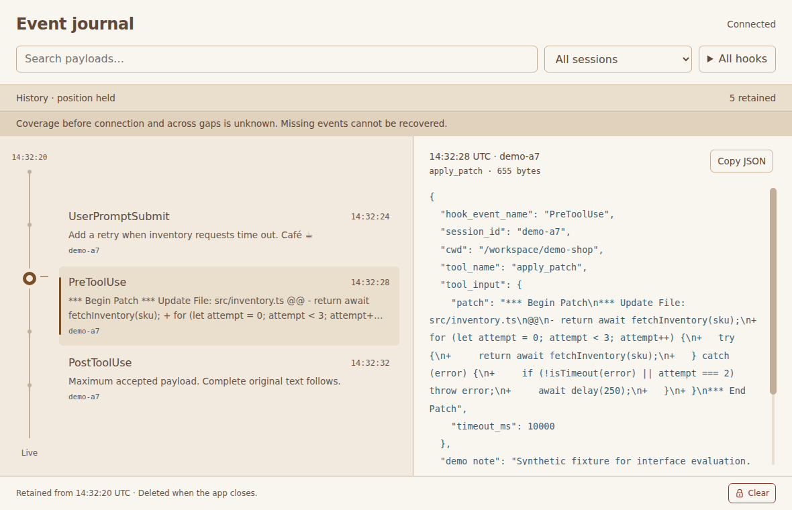
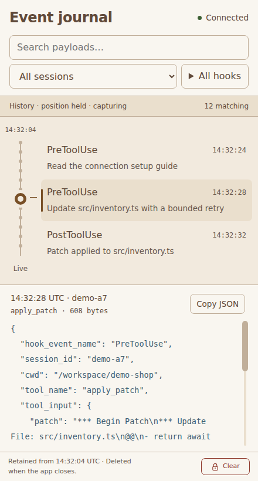
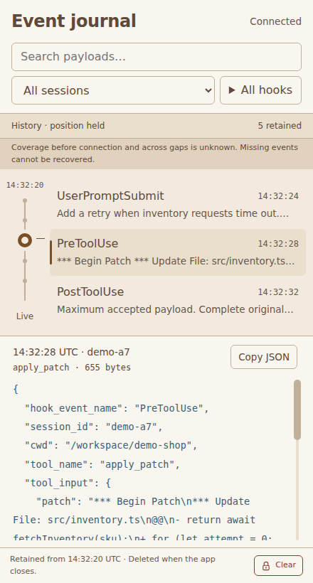

# Live transport validation on Linux

This is historical evidence from before the Rust/TypeScript port. Commands and
tool versions below describe that earlier checkout. Current commands and evidence
are in [port validation](port-validation.md).

Issue #8 connects the actual Electron viewer to protocol version 1. All input
and evidence here are synthetic. The independent suite uses a bounded fake
collector; a separate command runs the landed Linux collector and sends one
synthetic Unix datagram. Neither command installs hooks, changes trust, records
real input or configures a private proxy.

Validated on Ubuntu 26.04.1 x64 under Xvfb, with Electron 44.3.0, embedded Node
24.20.0, SQLite 3.53.4, host Node 24.21.0 and Playwright 1.63.0. This establishes
Linux development behavior. Real Codex compatibility, private HTTPS proxy
routing, cross-account capture and macOS setup, performance, energy use, sleep
and native lifecycle remain unverified.

The original bare-Xvfb minimize checks below verified capture after calling
`minimize()`, but did not prove that the window became minimized. The
[integrated regression suite](electron-regression-validation.md) adds an
isolated Openbox session, requires `isMinimized()` to become true and
checks suppressed presentation during continued capture. Treat the older
minimize wording only as call-path coverage, not native minimization evidence.

## Architecture and limits

The existing SQLite worker also owns Node HTTP/HTTPS transport. The renderer
retains its sandbox, context isolation and `connect-src 'none'` policy. Endpoint
and token files stay outside it. No runtime dependency or extra OS process was
added. The current application bundle is 181,867 bytes; the stock Electron runtime is
295,827,900 bytes. Tests, screenshots, recordings and measurement tools stay out
of the bundle.

Node's [HTTP documentation](https://nodejs.org/docs/latest-v24.x/api/http.html)
explains that request timeouts only emit an event; this adapter destroys timed
out requests explicitly. It uses `agent: false` to keep heartbeat requests on
separate connections. [HTTPS](https://nodejs.org/api/https.html) supports explicit
certificate verification, which remains enabled. It never follows redirects.
The existing worker follows [Electron's performance guidance](https://www.electronjs.org/docs/latest/tutorial/performance)
for keeping blocking work off UI threads and its [security guidance](https://www.electronjs.org/docs/latest/tutorial/security)
for renderer isolation and secure connections. The current Node 24 HTTP API
reference was checked alongside the pinned embedded runtime; no new API beyond
that runtime is required.

| Limit | Behavior and measured basis |
| --- | --- |
| 393,216 bytes per frame, including newline; 61,440 payload bytes | Protocol compatibility ceilings. A fixed frame buffer accumulates arbitrary chunks and fatal UTF-8 decoding occurs only after the frame fits. Payload bytes and well-formed text are checked before parsing the payload object. Full original text remains unchanged. |
| One stream, one heartbeat, one retry timer | No request pool or offline event queue. A new attempt waits for the previous read/processing task to finish. Retries wait 500 ms, doubling to 8 seconds; stable connections reset the backoff. Authentication, version, endpoint and TLS failures require restart. |
| 2,500 ms for response/hello; 1,500 ms for heartbeat response | Deadlines destroy the requests. Heartbeats start every 2,000 ms and require 204. They stop after 4,000 ms without processed input, or when the one current storage operation has taken 2,000 ms. The collector's 6,000 ms lease remains authoritative. |
| One event being processed | Network parsing awaits storage in the same worker. A blocked worker cannot run an independent heartbeat timer. A delayed asynchronous test operation retains its one slot until completion, then reconnects. Clear changes the shared generation first, so old callbacks cannot write. |
| 64 KiB response high-water mark; 512 KiB burst credit; 2 MiB/s input budget | The observed largest read was 65,536 bytes. The budget admits the sustained and maximum-payload workloads below; an excessive burst closes the connection and reports unknown loss. No buffered transport data survives reconnect. |
| 512 frame burst credit and 512 frames/s | Bounds parsing work even for tiny unknown frames. This exceeds the collector's 200-event/s ceiling while covering health messages. The 2,000-event burst reached the limit and recovered. |
| Existing storage and renderer limits | Four broker requests, five visible summaries, one selected payload, 10,000 rows, 8 MiB accounted retention, 16 MiB database, 33 MiB including sidecars, 2 MiB SQLite cache and 8 MiB SQLite heap remain unchanged. The transport bypasses the synthetic broker queue and never queues storage messages through main. |
| Private settings: 4,096 bytes; token: 256 characters plus newline | Only owned regular files without group/other permissions are read. Config uses an HTTPS origin and absolute token-file path. HTTP accepts literal loopback IPs for local tests; paths, credentials, query, fragment, redirects and invalid TLS are rejected. Settings changes take effect on restart. |

Collector health totals have six fixed reasons. Each report replaces the
previous totals, including a reset to zero after a collector restart. They are
never summed across connections and never called recording-local. Local
storage drops remain separate. The initial connection and every gap have
unknown coverage even when known counters exist. Terminal connection errors also
survive Clear until settings are reloaded on application restart.

The parser validates the first hello, UUID connection IDs, positive increasing
safe sequences with permitted gaps, required metadata, UTC receive time,
payload byte counts and finite JSON numbers. Unknown envelope fields and
message types stay within the same frame and rate bounds. Local SQLite IDs
control navigation even when remote timestamps go backwards.

## Checks

Run from `electron/` after `npm ci`, runtime setup and `npm run build`:

```bash
npm run test:unit
xvfb-run -a -s '-screen 0 1600x1000x24' npm run test:electron
xvfb-run -a -s '-screen 0 1600x1000x24' npm run test:collector
xvfb-run -a -s '-screen 0 1600x1000x24' npm run measure:transport
```

The unit suite passes 20 tests. It covers every byte split of representative
hello/event/health frames, real-socket event splits, bytewise multibyte text,
combined frames, exact byte retention, complete/unfinished limits, malformed
UTF-8 and JSON, required-field/version/ID/sequence/byte failures, unknown fields
and types, private settings, invalid TLS, 401/409/503/redirects, response
headers/deadlines, heartbeat failures, silent input, stuck processing, bounded
retries, counter reset and no replay requests.

The full Electron run passed 21 tests across history, inspection, navigation
and transport. A later focused run passed all four transport scenarios, including
the added worker-exit and restart regression. It exercises held reconnect at a nonzero offset, authentication
and second-viewer errors, distinct collector/local drops, counter reset,
Clear with delayed input and queries, explicit cleanup failure, recovery, copying, hidden/minimized
capture and the prior filtering, storage-pressure, eviction and lifecycle flows.
After visual inspection corrected opening-screen wording and duplicate cleanup
errors, the six affected recorded scenarios passed again. No browser-only result
substitutes for these Electron checks. Unexpected worker exit changes the header
to Disconnected, stops requests and explains that restart is required; restart
cleans the abandoned recording and begins fresh capture.

The [separate collector result](evidence/electron-transport/result.json) records
exact synthetic byte retention, connection survival beyond the six-second lease,
and preserved history after collector shutdown. Its process is launched through
the Linux CLI, not imported into Electron. This loopback result does not validate
private HTTPS proxy behavior. The independent Electron suite never starts Linux.

## Resource observations

[Raw measurements](evidence/electron-transport/measurements.json) record all
segments, versions and process roles. The successful run used an isolated
process session with no recording or other application tests. Its 181,038-byte
application preceded 829 bytes of opening/Clear display and worker-exit status corrections; the stream, parser,
storage and retry code measured here is unchanged. The complete suite passed before those corrections; affected recorded
scenarios and the added worker-exit case passed again afterward. An earlier run
terminated with exit status 143 before writing a complete report; its cause is
unproven and its partial observations are excluded.

The sampler includes all Electron process-group members and descendants at
250 ms intervals. The worker is included within main. Summed RSS counts shared
pages more than once. PSS apportions them and is an endpoint snapshot, not a
peak. The existing privileged helper reads aggregate Linux memory counters only.
CPU 100% means one core. The fake server, test driver and sampler are excluded.

| Workload | Seconds | Mean CPU | Peak summed RSS, MiB | Final PSS, MiB |
| --- | --- | --- | --- | --- |
| Connected idle | 4.2 | 5.8% | 638.1 | 306.4 |
| 1,800 small events, 6 ms offered spacing | 12.1 | 48.0% | 676.4 | 339.0 |
| 240 maximum payloads, 65 ms offered spacing | 16.1 | 36.1% | 733.0 | 387.9 |
| 250 events with 100 ms storage delay, then drain | 5.4 | 13.0% | 729.8 | 390.8 |
| 2,000-event burst and recovery | 3.3 | 16.2% | 732.2 | 392.8 |
| One 6,500 ms storage stall and recovery | 8.7 | 5.7% | 732.2 | 366.9 |
| 600 events after recovery | 4.2 | 40.3% | 709.9 | 322.9 |
| Settled connected idle | 5.0 | 2.3% | 660.7 | 320.6 |

Across 4,891 offered events, 3,526 were stored, 1,890 oldest rows were evicted,
and 25 were rejected during bounded storage cleanup. The fake server refused
454 writes at its own 512 KiB pending-write limit. The transport closed once for
input rate and once for stalled storage; those intervals have unknown losses.
These counts do not establish complete delivery coverage.

Peak transport processing was one event. Three connection attempts and 26
heartbeats used at most two concurrent server sockets. The synthetic broker
queue was unused. Largest observed frame content was 61,706 bytes, excluding newline, and read was 65,536
bytes. Final accounted retention was 8,386,171 bytes; database, owner marker and
active journal peaked at 8,487,570 bytes. Worker intake peaked at 18.3 ms. The
20 ms timer recorded at most 196.7 ms extra delay in main and 202.7 ms in the
renderer. Held selection and payload offset survived delayed storage. Stalled
processing stopped renewals, and capture resumed after release without old input.

The fixed parser/storage working sets do not depend on recording duration.
These short measurements validate their behavior for the tested workloads;
prior [history](electron-history-validation.md) and [navigation](electron-navigation-validation.md)
checks cover retention cycles. No long-duration, Mac or energy result is claimed.

## Recorded experience

The reference and implementation below both select the synthetic patch at
14:32:28 UTC in demo-a7. The unchanged prototype's outer demo controls are
omitted. The app has five stored fixtures instead of the prototype's twelve,
preserves original JSON, and displays real connection/coverage status. Its
slider maps all retained events, so the pin differs from the prototype's
row-centered marker. The selected controls, colors and simultaneous journal and
payload layout remain unchanged. At narrow widths, long status text scrolls
within its bounded area and supports keyboard focus. Identical status text does
not repeatedly replace live regions. Inspection found an empty live connection
still saying synthetic, including during startup; both now use accurate wording.
A failed Clear now shows one cleanup explanation without a Reset filters action. Regression also found
a resize could replace a pending Home target with the displayed event. Resize
refresh now waits for the requested navigation to settle; a controlled delayed
reply test resizes during eviction and checks the intended retained target.

| Reference, 1180 × 760 | Actual Electron, 1180 × 760 |
| --- | --- |
|  |  |

| Reference, 440 × 820 | Actual Electron, 440 × 820 |
| --- | --- |
|  |  |

| Recording | Scenarios |
| --- | --- |
| [Transport walkthrough](evidence/electron-transport/transport-walkthrough.webm) | Connected empty state, matching desktop/narrow comparisons, disconnect/reconnect while held, collector/local drops, narrow keyboard status scrolling, counter reset, delayed Clear/input/query rejection, copy, hidden/minimized capture, recovery and cleanup failure. |
| [Authentication](evidence/electron-transport/authentication-walkthrough.webm) | Terminal authentication failure without futile requests; the following restarted run uses corrected credentials. |
| [Second viewer](evidence/electron-transport/conflict-walkthrough.webm) | Conflict at desktop/narrow widths, bounded retry and recovery after the lease becomes available; later authentication failure remains terminal after Clear. |
| [Stalled processing](evidence/electron-transport/stalled-walkthrough.webm) | Held payload offset during a storage stall, stopped heartbeats, discarded old input and successful reconnect. |
| [Delayed navigation](evidence/electron-transport/late-target-walkthrough.webm) | Pending Home request, resize during retention eviction, discarded old result and correct retained target. |
| [Worker exit](evidence/electron-transport/worker-exit-walkthrough.webm) | Unexpected worker exit stops capture and reports Disconnected with restart guidance at desktop/narrow widths; the last visible text remains readable. |
| [Worker restart](evidence/electron-transport/worker-restart-walkthrough.webm) | Restart with the same recording owner removes abandoned history and receives fresh events. |
| [Landed collector](evidence/electron-transport/real-collector-walkthrough.webm) | Actual Linux collector with synthetic input, lease renewal, collector stop and retained history. |

Full-size failure and recovery states include [held disconnect](evidence/electron-transport/disconnected-held.png),
[held reconnect](evidence/electron-transport/reconnected-held.png),
[collector and local drops](evidence/electron-transport/collector-local-drops.png),
[narrow local drops](evidence/electron-transport/local-drops-narrow.png),
[authentication failure](evidence/electron-transport/authentication-failed.png),
[second-viewer recovery](evidence/electron-transport/second-viewer-recovered.png),
[stalled storage](evidence/electron-transport/stalled-storage.png),
[stall recovery](evidence/electron-transport/stalled-recovered.png),
[Clear recovery](evidence/electron-transport/clear-recovered.png),
[Clear failure](evidence/electron-transport/clear-cleanup-failed.png),
[authentication after Clear](evidence/electron-transport/authentication-clear.png),
[resized late navigation](evidence/electron-transport/late-evicted-target.png),
[worker exit](evidence/electron-transport/worker-exit.png),
[worker restart](evidence/electron-transport/worker-restart-recovered.png) and
[real collector](evidence/electron-transport/real-collector.png).
