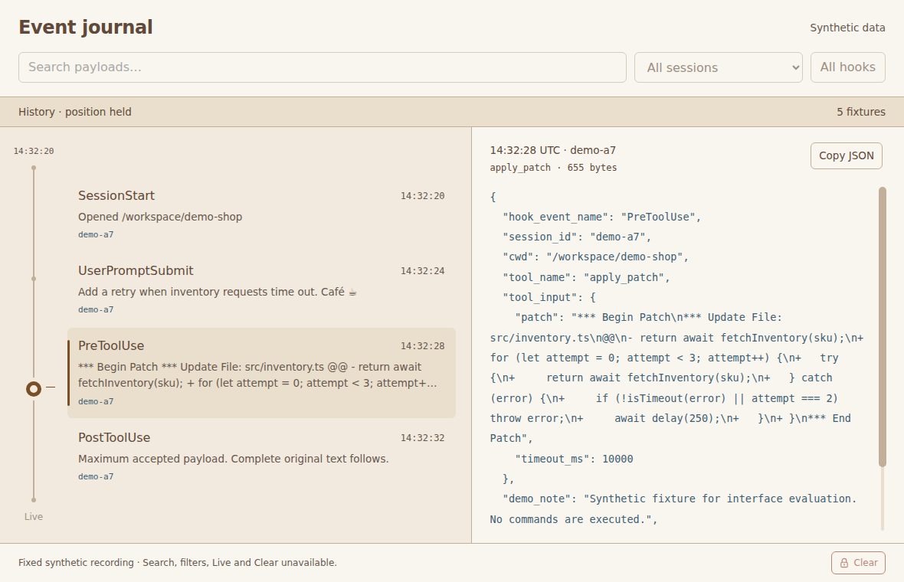
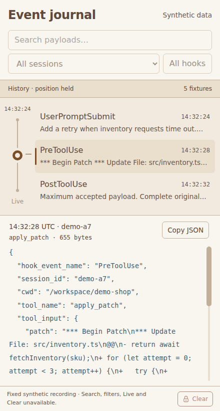

# Linux Electron validation

Validated on 2026-09-11 for the finite fixture inspector in issue #5. All data,
screenshots and recordings here are synthetic. This delivery does not implement
live transport, SQLite history, search, filters, scrub navigation or Clear.
Linux evidence does not establish real Codex compatibility or macOS behavior.

## Environment and commands

Ubuntu 26.04.1 x64, Linux 7.0.0-31-generic, two DO-Regular virtual CPU cores,
3,910 MiB RAM, Xvfb at 1600 × 1000 × 24. Host Node 24.21.0 and npm 11.19.0.
Electron 44.3.0 embeds Chromium 152.0.7977.78, Node 24.20.0 and V8
15.2.124.19-electron.0. Playwright 1.63.0 and its FFmpeg build 1011 record the
tests. The runtime uses software rendering on this Xvfb VM. No GPU-disabling
flag is supplied, and the GPU process remains present.

The [clean-checkout instructions](../electron/README.md) install and run the
viewer without Linux application dependencies. This VM requires Electron's
root-owned mode-4755 sandbox helper because unprivileged user namespaces are
restricted. App preferences and automation keep sandboxing and context
isolation enabled, with renderer Node integration disabled.

```bash
cd electron
npm ci
npx install-electron
npx playwright install ffmpeg
# Configure chrome-sandbox as documented if the host requires it.
npm run build
xvfb-run -a -s '-screen 0 1600x1000x24' npm test
```

The final working-checkout run passed seven Node tests and six actual Electron
tests. The Electron suite took 48.1 seconds. A separate clean source export
installed its own dependencies and passed the same seven Node and six Electron
tests; its Electron suite took 42.4 seconds. It received no existing
`node_modules`, `dist`, test results or local runtime state. Its 15 application,
fixture, build and test inputs were byte-compared with this checkout. The
shared protocol fixture is the only input outside `electron/` used by its tests.

## What the checks prove

| Check | Observed result |
| --- | --- |
| Local build | `dist/app` contains nine application/fixture files, with no test, recording or package dependency assets. The actual app loads those local files. |
| Protocol and byte retention | Shared version 1 fixture accepted. Original whitespace, CRLF, tabs, Unicode and unknown fields survive inspection and clipboard round trips. |
| Large or difficult JSON | A 61,440-byte payload stays complete and navigable through its final marker. A 4,000-level array is displayed without recursive formatting. Long session/tool labels keep the payload and byte count visible. |
| Rejection and limits | 61,441-byte input is rejected whole. Invalid UTF-8, JSON, non-finite numbers, metadata, byte counts, source/frame sizes and request arguments are rejected. Count and aggregate-byte limits discard excess input. Valid neighboring events remain usable. |
| Isolation | Actual BrowserWindow preferences confirm sandbox and context isolation on, Node integration off. Renderer `require` and `process` are absent. Remote fetch, navigation and extra-window attempts fail. A different BrowserWindow cannot use the main window's inspection handler. |
| Pending operations | A burst of 100 preload inspection calls permits one in flight. A stalled native clipboard write reports failure after two seconds; retries do not start another native write. Copy succeeds after the native operation settles. |
| Scrollbar | Wheel, track click, thumb drag with an off-center grab, touch dragging on thumb and text, Arrow keys, Page keys, Home and End work. Accessible values reach 0 and 100, focus remains visible, and a fitting payload hides the control and removes its tab stop. |
| Selection and resize | Buttons select the matching original payload. Enter works and retains button focus. The same selected payload retains a nonzero offset across 1180, 980 and 440 pixel widths. The journal and payload remain visible together at 440 × 820 and 360 × 640. |
| Failure and recovery | Copy rejection and timeout display a retryable error. Empty and unreadable fixtures explain their state. Restoring the fixture and restarting restores inspection. |

These tests do not prove clipboard behavior on macOS, native trackpad hardware,
Mac window chrome, sleep, force-quit cleanup, real traffic, database pressure or
long-running capture. Touch input is Chromium's emulated touch input in the
actual Electron window. Future history and transport issues retain their
separate handoff checks for arrivals, query cancellation, gaps, eviction,
Clear and resource pressure.

## Visual evidence

The implementation's screenshots and recorded frames were inspected after
the final UI changes. The walkthrough was inspected at half-second intervals,
alongside full-size screenshots of important states. It covers selection,
original-text copying, failure/recovery, fitting and maximum payloads, each
scroll input, offset-preserving resize, deep JSON and narrow keyboard use.
The remaining recordings cover security and the failure states in the table.

| Reference, 1180 × 760 | Actual Electron, 1180 × 760 |
| --- | --- |
|  |  |

| Reference, 440 × 820 | Actual Electron, 440 × 820 |
| --- | --- |
|  |  |

Both comparisons select the patch payload at 14:32:28 UTC for session demo-a7.
The reference's outer demonstration frame, fake titlebar and demo buttons are
omitted to compare application content at equal sizes. The source prototype
is unchanged. The app uses native window chrome, a finite set of five fixtures
and original payload text. Its desktop neighborhood shows four rows at this
size to allow two-line previews; the narrow layout shows three. The fixture
includes an unknown field, so its original byte count differs from the
prototype's reconstructed object. Search/filter/Clear controls are disabled,
the journal pin is static, and Synthetic data replaces a connection claim.
These scope differences are recorded in [ux.md](../ux.md).

| Recording | Scenarios |
| --- | --- |
| [Inspector walkthrough](evidence/electron-fixtures/walkthrough.webm) | Desktop, selection, copy success/failure/recovery, short payload, maximum payload, wheel, keyboard, track click, thumb grab/drag, touch, resize, deep JSON, narrow and minimum windows. |
| [Security restrictions](evidence/electron-fixtures/security.webm) | Attempts to navigate or load remote content leave the inspector usable. Assertions also verify sandbox preferences and foreign IPC rejection. |
| [Clipboard timeout and recovery](evidence/electron-fixtures/clipboard-timeout.webm) | One stuck native write, visible timeout, bounded retry and subsequent recovery. |
| [Long metadata](evidence/electron-fixtures/long-metadata.webm) | Long session/tool labels, retained byte count and complete copying at 360 × 640. |
| [Oversized rejection](evidence/electron-fixtures/oversized.webm) | Rejected 61,441-byte fixture and usable valid history. |
| [Empty](evidence/electron-fixtures/empty.webm), [unreadable](evidence/electron-fixtures/unreadable.webm), [recovered](evidence/electron-fixtures/recovered.webm) | Empty recording, invalid fixture file and recovery after restoring the file and restarting. |

Additional full-size states include [copy failure](evidence/electron-fixtures/copy-failure.png),
[the last bytes of a maximum payload](evidence/electron-fixtures/maximum-end.png),
[long metadata](evidence/electron-fixtures/long-metadata.png) and
[the minimum window](evidence/electron-fixtures/minimum-window.png).

## Resource measurements

[Raw measurements and inventory](evidence/electron-fixtures/measurements.json)
contain workload summaries, exact versions, startup trials and fixture
sizes. Run each `npm run measure -- baseline|inspector|capacity` command under
Xvfb as shown in the development guide. Measurements run separately from
video recording. Playwright's debugger remains attached for both applications;
its process and the measurement reader are outside the Electron process group.

Startup means a fresh Electron process through the first ready, painted
application content. OS filesystem caches remain warm; these are not cold-disk
measurements. Three launches per target gave:

| Target | Startup trials, ms | Median, ms |
| --- | --- | --- |
| Empty window | 1051, 880, 900 | 900 |
| Five-fixture inspector | 1346, 1094, 1110 | 1110 |
| Capacity fixture | 1187, 1018, 1265 | 1187 |

The default recording retains 5 events and 70,623 original payload bytes. The
capacity recording retains 16 events and 246,936 bytes, including four maximum
payloads. Measurements enumerate the whole process group and descendants,
including Chromium's renderer, GPU, utility and sandbox processes. Both
applications use eight processes, including four zygote/sandbox processes.
The application adds none.

RSS sums shared pages more than once. PSS apportions those pages and gives a
more useful estimate of total physical memory. A read-only privileged `/proc`
counter read supplies the final PSS snapshot because Linux restricts access to
sandboxed processes. No memory contents are read and no sandbox is disabled.
RSS is the peak among samples; PSS is a final snapshot, not a measured peak.
CPU is the mean across sample intervals, with 100% meaning one CPU core. The
sampler waits 250 ms between reads; actual intervals include collection work.

| Workload | Mean CPU | Peak summed RSS, MiB | Final total PSS, MiB |
| --- | --- | --- | --- |
| Empty window, 6 seconds idle | 0.30% | 606.00 | 274.78 |
| Inspector, 6 seconds idle | 0.47% | 634.73 | 289.86 |
| Inspector, maximum payload held for 4 seconds | 0.00% | 644.00 | 301.17 |
| Inspector, 60 alternating selections and 60 Home/End scrolls | 71.70% | 699.25 | 354.14 |
| Inspector hidden for 6 seconds after interaction | 0.00% | 700.02 | 351.93 |
| Capacity recording, 6 seconds idle | 0.15% | 638.71 | 293.56 |
| Capacity recording, maximum payload held for 4 seconds | 0.24% | 643.95 | 301.31 |
| Capacity recording, 60 alternating selections and scrolls | 72.09% | 708.91 | 349.61 |

The default inspector's idle PSS is 15.08 MiB above the empty window in these
runs. Rapid interaction consumes substantial CPU in the VM's software renderer.
End-to-end selection latency, including debugger round trips and a paint
opportunity, averaged 47 ms, with p95 103 ms and maximum 120 ms. The capacity
run averaged 56 ms, with p95 123 ms and maximum 171 ms. These short workloads
do not establish sustained-capture or memory-pressure limits.

Twenty copies of the maximum payload took about 5 to 56 ms each end to end.
The two-second failure deadline leaves room above that measured range while
keeping failure feedback bounded. Its stuck-operation behavior is tested
separately. One hundred adapter parses on the host Node runtime gave p95 near
6 ms for both fixture sizes in the inspector run. That parsing measurement is
not a renderer-thread measurement.

## Tested budgets and dependency cost

The finite admission limits stay within the measured capacity workload. They
are not proposed live-recording defaults. No data arrives after startup.

| Limit | Basis and behavior |
| --- | --- |
| 61,440 original bytes per payload | Shared protocol ceiling; full navigation/copy at the limit and rejection one byte above it are tested. |
| 393,216 bytes per NDJSON frame | Shared protocol ceiling; larger frames are dropped before parsing. |
| 16 events and 256 KiB original payload bytes | Capacity run exercises all 16 slots and four maximum payloads. Unit checks exceed both limits independently and retain the accepted events without truncation. |
| 1,966,080 source bytes | Sixfold JSON string-escape allowance for the aggregate payload budget plus one maximum frame for envelopes. The file is read through a fixed upper bound. |
| At most 5 summaries and one displayed payload | Layout renders three to five neighboring buttons. There is one inspection in flight and one replaceable next target. Summary labels are limited to 160 characters and previews to 180. |
| One native clipboard operation | Two-second response deadline; the native operation keeps its slot until it settles. |
| No formatting expansion | A single original-text node handles the complete accepted payload. Deep nesting cannot generate indentation, nested DOM or syntax-highlighting work. |

`dist/app` occupies 100,836 bytes. The stock Linux x64 Electron runtime occupies
295,827,900 bytes, about 282.1 MiB, including its bundled Chromium and Node
resources. The app does not add a process, server or application package.
The runtime dominates distribution size. These are unpacked file sizes, not
installer or compressed download sizes.

All 16 npm packages are development dependencies and are excluded from
`dist/app`. The locked inventory is:

| Purpose | Packages and exact versions |
| --- | --- |
| Runtime download, extraction and declarations | electron 44.3.0; @electron/get 5.1.0; @electron-internal/extract-zip 1.0.5; @types/node 24.13.4; undici-types 7.18.2 |
| Installer support | debug 4.4.3; ms 2.1.3; env-paths 3.0.0; graceful-fs 4.2.11; progress 2.0.3; semver 7.8.5; sumchecker 3.0.1; undici 7.29.1 |
| Test automation | @playwright/test, playwright and playwright-core, all 1.63.0 |

The FFmpeg executable is Playwright's separate development cache download.
It and the tests, screenshots, recordings, measurement scripts and reference
prototype are absent from the application bundle.

## Runtime choice

Release notes were rechecked before pinning the current stable Electron
44.3.0. Electron 43 introduced startup snapshots, cached preload bytecode and
less blocking startup IPC. Electron 44 adds initialization/IPC improvements and
Linux startup work. Only 44.3.0 was measured here; this is not a 43-versus-44
benchmark. Sources: [Electron 43](https://www.electronjs.org/blog/electron-43-0),
[Electron 44](https://www.electronjs.org/blog/electron-44-0).

Electron 44's clipboard reads and writes are asynchronous, and direct renderer
module access was removed. The inspector awaits `clipboard.writeText` in main
and exposes copying by event ID. Real clipboard round trips and simulated
rejection/stall cases prove the pinned combination's behavior on this VM.
Source: [clipboard API](https://www.electronjs.org/docs/latest/api/clipboard).

Built-in context isolation, sandboxing, custom protocols, permission handling,
clipboard operations and browser text layout cover this slice. Window-state
persistence and SQLite are not needed yet, so no replacement packages or
workers are introduced. The implementation follows the current
[performance](https://www.electronjs.org/docs/latest/tutorial/performance) and
[security guidance](https://www.electronjs.org/docs/latest/tutorial/security).
Playwright's [Electron support](https://playwright.dev/docs/api/class-electron)
is experimental; its pinned launch, screenshots and video were tested under
Electron's documented [Xvfb environment](https://www.electronjs.org/docs/latest/tutorial/testing-on-headless-ci).
